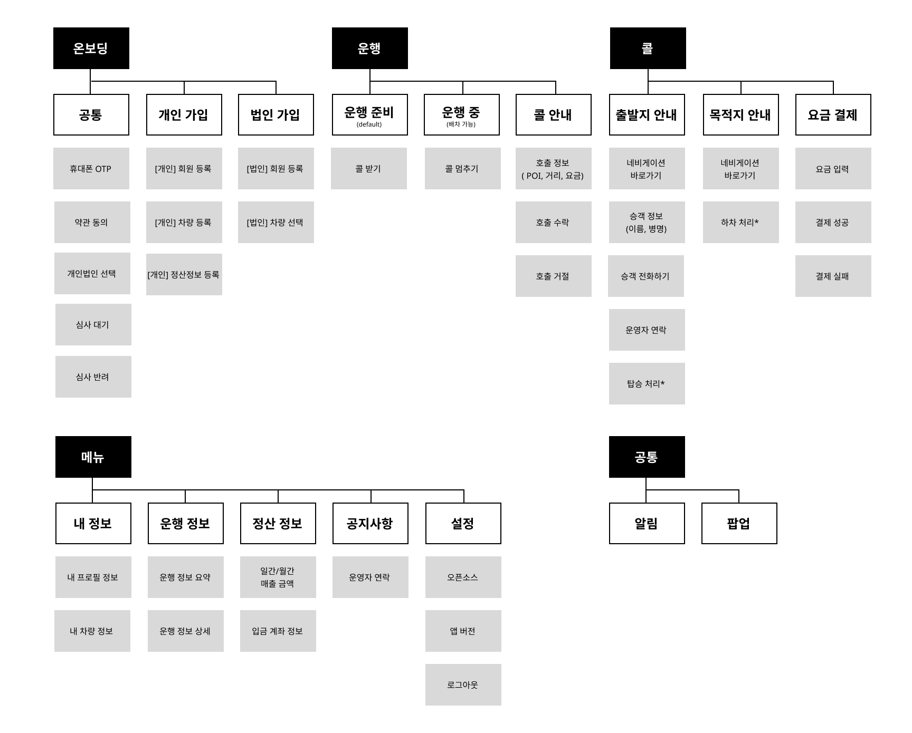
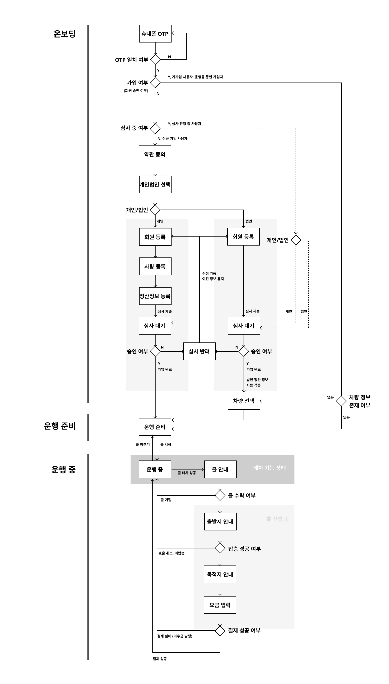
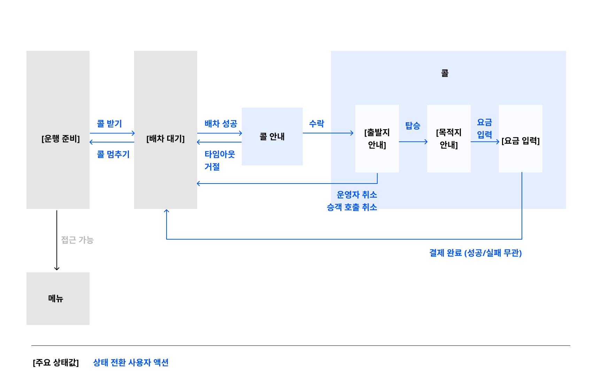
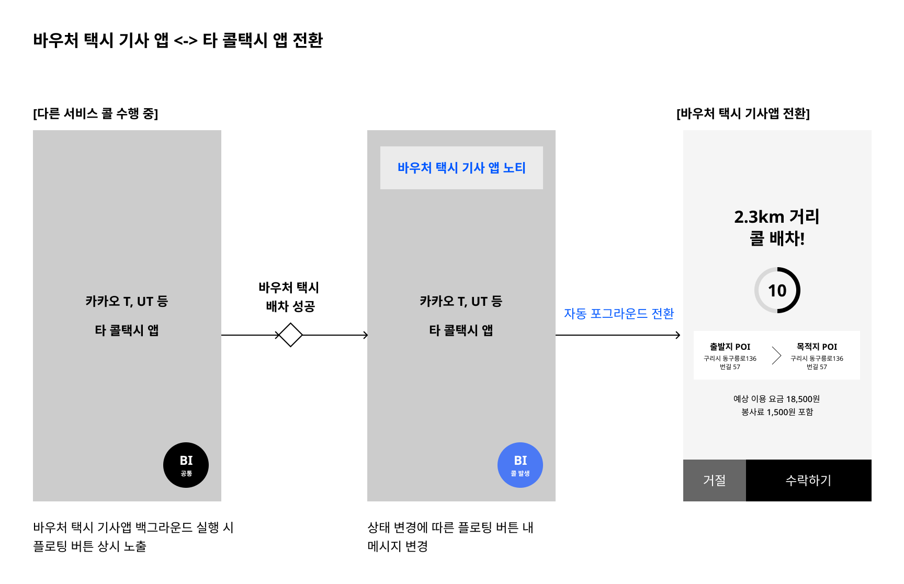

# 00. Overview

## (1) 사용자

- 경기도 내 법인/개인 택시 기사 중 이즐이 정산사인 자 (최대 1만 4천여명)
- 경기 구리시를 시작으로 31개 도시에 점진적으로 확대 

## (2) 지원 환경

- 최소 OS 지원 버전 : API 26 (Android 8.0, Oreo)
- 주요 타겟 디바이스 : 갤럭시 A 시리즈, 갤럭시 S 시리즈
- 세로 모드만 지원하고 가로 모드는 지원하지 않는다. 
- 하기 디바이스 세팅 중에서 **A 케이스**를 메인 시나리오로 가정한다. 
  - **A. 스마트폰 1개로 전화도 하고, 콜도 받고** 
  - B. 개인(전화) 스마트폰, 콜전용 스마트폰 2폰 이용 
  - C. 개인(전화) 스마트폰, 콜전용 태블릿 이용

## (3) 서비스명

- 마켓 서비스명 : 셔클 기사앱 - 경기도 바우처 택시 
- 앱 인스톨 시 서비스명 : 셔클 기사앱
> - 추후 사업 확장 방향에 따라 서비스명 "-" 뒤에 설명 변경 가능 
> - (예) 동일 지역 일반 택시로 확장 시 : 셔클 기사앱 - 경기도 택시 
> - (예) 바우처 택시로 지역 확장 시 : 셔클 기사앱 - 경기 강원 제주 바우처택시

## (4) IA

## (5) Flowchart

## (6) 주요 액션과 상태 변환

## (7) 앱 전환 동선 

- 타 콜택시 앱 사용 중에 새로운 콜 발생 시, 플로팅 버튼을 통해 즉각적으로 확인할 수 있다.

## (8) 추후 지원 고려 항목 

- [온보딩] 디바이스 변경 시 추가 정보 확인 진행 
- [온보딩] 최신 약관 동의
- [콜안내] 출발지 도착 상태값 고려 
- [콜안내] 미터기 금액 연동
- [메뉴] 네비게이션 설정
- [메뉴] 내정보 수정
- [메뉴] 기사 등급/점수/배지 등 평가 관리
- [메뉴] 현위치 확인 
- [메뉴] 콜 수신 상태 확인
- [메뉴] 자주 찾는 질문
- [메뉴] 화면 밝기/글자 크기 조정
- [운행, 콜] TTS 안내

