# 03. 콜 (❄️v4.10)
> 콜 수락 ~ 요금 입력에 대한 설명

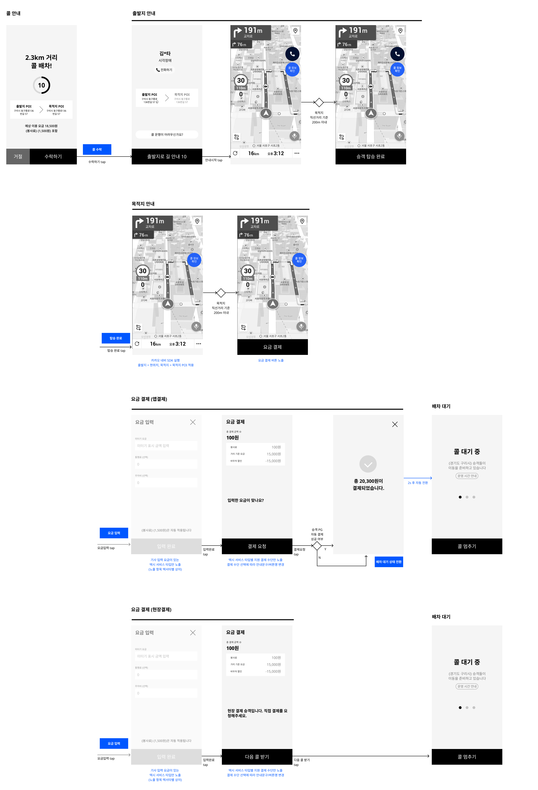

> 화면 레이어 구조 참고 
>
> - 상위 레이어에 해당하는 화면은 하위 레이어에 해당하는 화면의 위에 노출되고, 같은 레이어의 화면은 서로의 위나 아래에 노출될 수 없다.
>   - 단, 네비게이션 뷰의 경우, 사용자가 명시적으로 하위 레이어의 화면을 호출하는 경우에 한하여 하위의 화면이 상위에 노출될 수 있다. 
>   - 이 때 네비게이션 안내 동작은 그대로 유지한다.
> - 상위 레이어의 Activity가 종료됬을 때 별도의 정의가 없다면, 하위 레이어의 화면으로 전환한다. 

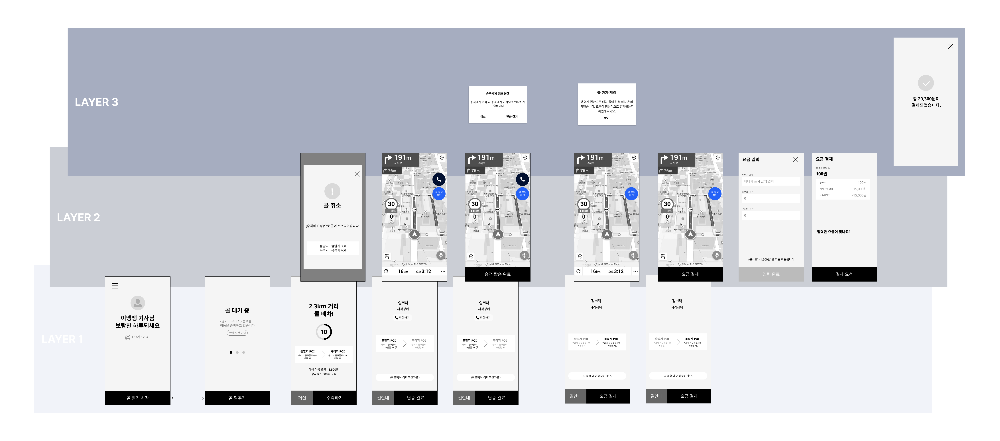

## (1) 출발지 안내

> 승객의 정보를 확인하고 출발지까지 길안내를 통해 이동할 수 있다. 출발지를 미세 조정해야 하는 경우 승객과 통화를 통해 조정하며, 콜을 수행하기 어려운 상황에는 이동약자지원센터로 통화가 가능하다. 

### A. 플로우

#### a. 출발지 길안내 

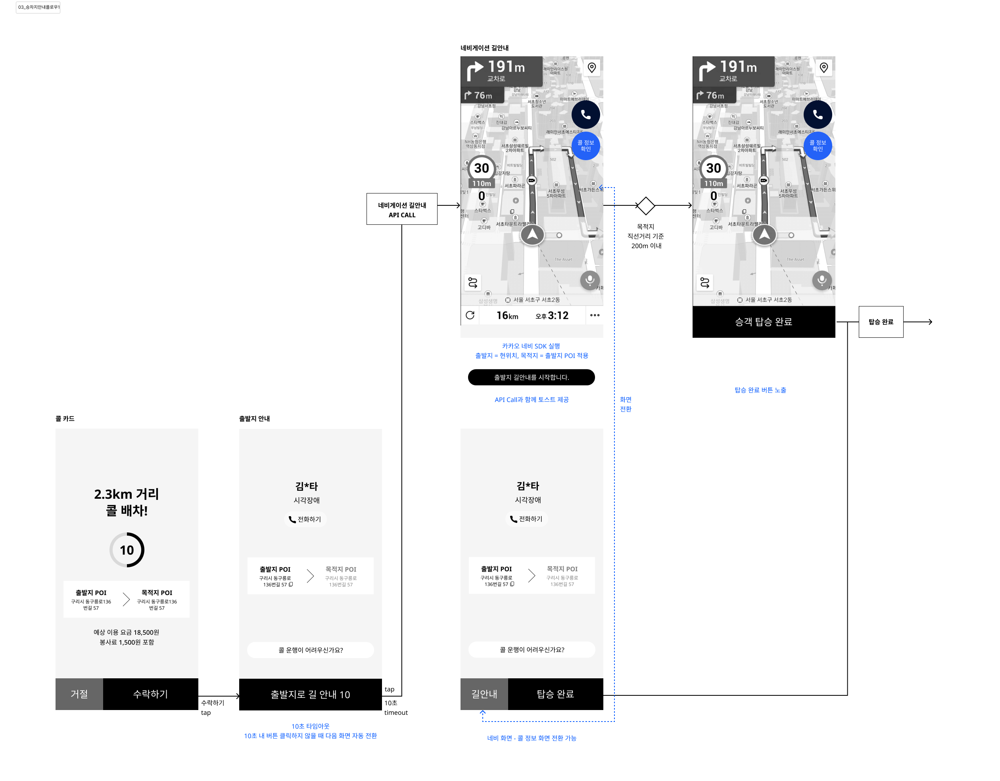

- **콜 카드 화면**에서 콜 수락 시 **출발지 안내 화면**으로 랜딩한다. 
- 출발지 길 안내 버튼 선택 시 **네비게이션 길안내** 화면으로 전환되며 카카오 네비게이션 SDK 길안내를 시작한다
  - 출발지 : 현위치 / 목적지 : 출발지 적용해서 API 콜 
  - API 콜 시점에 토스트 안내 제공 : 출발지 길안내를 시작합니다.
- **네비게이션 길안내** 화면에서 사용자가 원한다면, **출발지 안내** 화면으로 전환할 수 있다 
- **출발지 안내** 화면에서 사용자가 원한다면, **네비게이션 길안내** 화면으로 전환할 수 있다. 
- **네비게이션 길안내** 화면에서 목적지 인근에 도착 시 탑승 완료 버튼이 추가 노출된다 
  - 목적지 인근 기준 : 직선 거리 반경 200m 이내 

- **출발지 안내** 화면에서 상시적으로  탑승 완료 버튼이 노출된다. 
- 탑승 완료 시 (2) 목적지 안내 화면으로 이동한다 

#### b. 네비게이션 뷰 전환 상세 

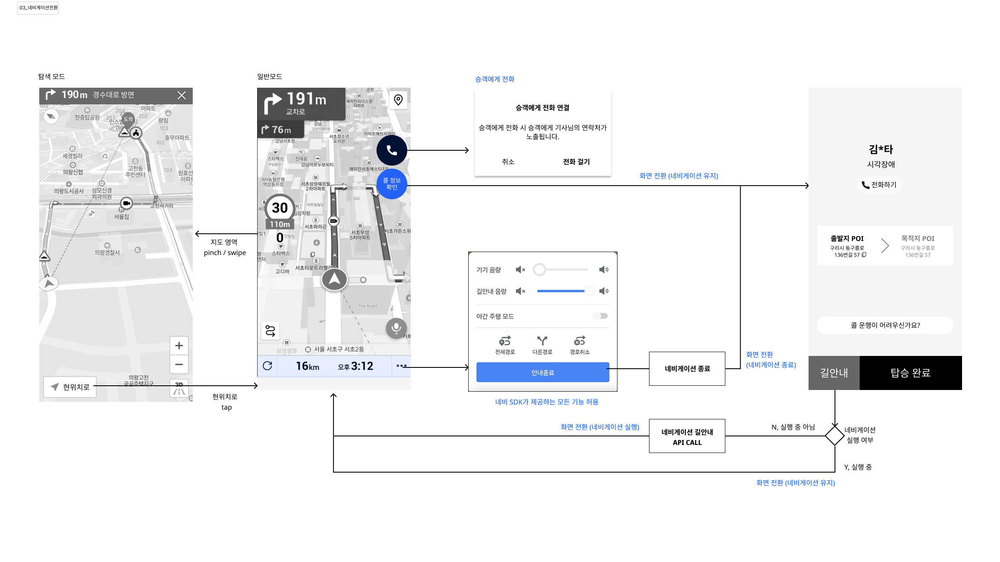

##### 일반모드 동작
- 네비게이션 UI 및 활용 기능은 카카오 SDK의 스펙을 따르며, 기획서 내 언급한 내용 외 별도로 커스텀하지 않는다.

- 콜 수락 ~ 요금 입력  전까지, 네비게이션 UI 위에 플로팅 버튼 2개를 추가 구성한다 
  - 승객 전화 버튼 : 네비 화면에서도 즉각적으로 승객에게 전화를 걸 수 있다
  - 콜 정보 확인 버튼 : 출발지 안내 화면으로 전환할 수 있다. 

##### 일반모드 - 탐색모드 전환
- 네비게이션 UI에서 지도 영역을 pinch in/out 또는 swipe 하는 경우, 탐색모드 화면으로 전환된다. 
- 탐색모드에서는 일반모드 내 제공하는 플로팅 버튼을 제공하지 않는다 
- 탐색모드에서 좌하단 [현위치로] 버튼 선택 시 일반모드로 전환된다.

##### 콜 정보 확인 

> 대부분은 네비게이션 길 안내를 유지하겠지만, 길 안내 중에 잠깐 승객 정보를 확인하거나, 이동약자지원센터로 연락하기 위해 활용할 것으로 예상. 원하는 정보를 확인하거나 태스크를 완수한 후 다시 네비게이션 길 안내 화면으로 전환될 것이라는 가정.

- 콜 정보 확인 버튼을 통해 화면이 전환된 경우, 네비게이션 안내를 종료하지 않는다. 
  - 드라이버는 네비게이션 길안내 TTS를 지속적으로 받을 수 있다. 

##### 네비게이션 안내 종료    

> 네비게이션이 문제가 있거나, 명시적으로 종료 후 새로이 길안내를 받고 싶을 때는 네비게이션 SDK 자체 제공 기능에서 안내 종료 할 수 있다. 이 때는 명시적으로 네비게이션을 종료 처리한다.

- 네비게이션 안내 종료 버튼을 통해 화면이 전환된 경우, 네비게이션 안내를 종료한다.  

##### 네비게이션 안내 시작   

- 출발지 안내 화면에서 길안내를 시작할 때, 네비게이션 실행 여부를 체크한다.
- 네비게이션이 실행 중일 때는 현재 안내를 유지한다
- 네비게이션이 미실행 중일 때는 네비게이션을 실행한다.  
  - 출발지 : 현위치 / 목적지 : 출발지 적용해서 API 콜 

##### [예외] 네트워크 오류 동작 

- 출발지 or 목적지 안내 화면 내 네트워크 유실 
  - 네트워크 에러 공통 토스트 노출 
  - 기능 진입 불가 
  - 적용 대상 : 승객 전화 /콜 취소 문의 / 길안내 / 승객탑승 완료 
- 네비게이션 화면 진입 후 네트워크 유실 
  - 네트워크 에러 공통 토스트 노출 
  - 네비게이션 화면 유지 (화면 전환 없음)

##### [예외] 지도 초기화 오류 동작    

- 네비게이션 화면 진입 후 지도 초기화 

  - 네트워크 에러 공통 토스트 노출
  - 출발지 or 목적지 안내 화면 강제 전환 

  

### B. 화면 구성

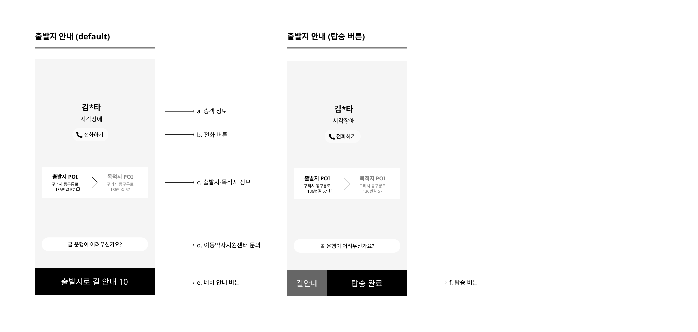

#### a. 승객 정보 

- 본인 확인 목적으로 승객 실명 정보를 노출하되 일부 글자를 마스킹 처리한다. 
  - 첫글자와 마지막 글자를 제외한 모든 글자를 마스킹 처리 
  - 단, 이름이 외자인 경우, 성은 노출하고 이름을 마스킹 처리 
  - 홍길동 : 홍O동 / 선우용여 : 선OO여 / 김신 : 김O
  
- 장애 타입에 따라 차량 탑승을 돕기 위해 주장애 유형을 노출한다.

#### b. 전화 버튼

- 승객과 전화 버튼 제공 
- 전화 발신 시, 승객 전화번호는 안심번호가 적용된다. 
- 상세 동선은 [공통 > 전화걸기 플로우 링크] 참고 

#### c. 출발지 - 목적지 정보

- 목적지보다 출발지 정보가 더 주목성 높게 제공한다. 
- `POI명` + `도로명 주소`를 노출한다.
- 도로명 주소 정보는 사용자가 원한다면 복사 가능하다. 

#### d. 이동약자지원센터 문의

- 관할 이동약자지원센터 전화번호로 전화 발신 
- 안심번호 미적용
- 상세 동선은 [공통 > 전화걸기 플로우 링크] 참고 

#### e. CTA 버튼 : 출발지로 길안내 버튼

- 출발지는 `현위치`, 도착지는 `출발지`가 적용된 네비게이션을 실행한다. 
- 네비게이션에 위치를 보낼 때는 `좌표` 값을 기준으로 전달한다. 
- 10초 내에 버튼 선택 시에는 동일 화면에서 하단 CTA 버튼이  f. 탑승 완료 버튼으로 자동 전환되며, 이 전환과 함께 티맵이 자동 실행된다. 
  - 티맵 기설치자는 티맵이 자동 실행된다. 
  - 티맵 미설치자는 별도 동작 없이 화면이 유지된다. 
- 10초 초과되어 타임아웃 됬을 때는 동일 화면에서 하단 CTA 버튼이  f. 탑승 완료 버튼으로 자동 전환되며, 티맵이 실행되지 않는다.

#### f. CTA 버튼 : 티맵 + 탑승 완료 버튼

- 티맵 버튼 선택 시, 출발지는 `현위치`, 도착지는 `출발지`가 적용된 네비게이션을 실행한다. 
  - 티맵 기설치자는 티맵이 실행된다. 

  - 티맵 미설치자는 구글 플레이 > 티맵 설치 페이지로 랜딩한다. 
  
- 탑승 완료 버튼 선택 시 해당 demand의 상태값은 `탑승 중`으로 전환된다. 

### C. [예외] 호출 취소 발생 시 (🎄v4.9.5)

#### a. 플로우  (🎄)

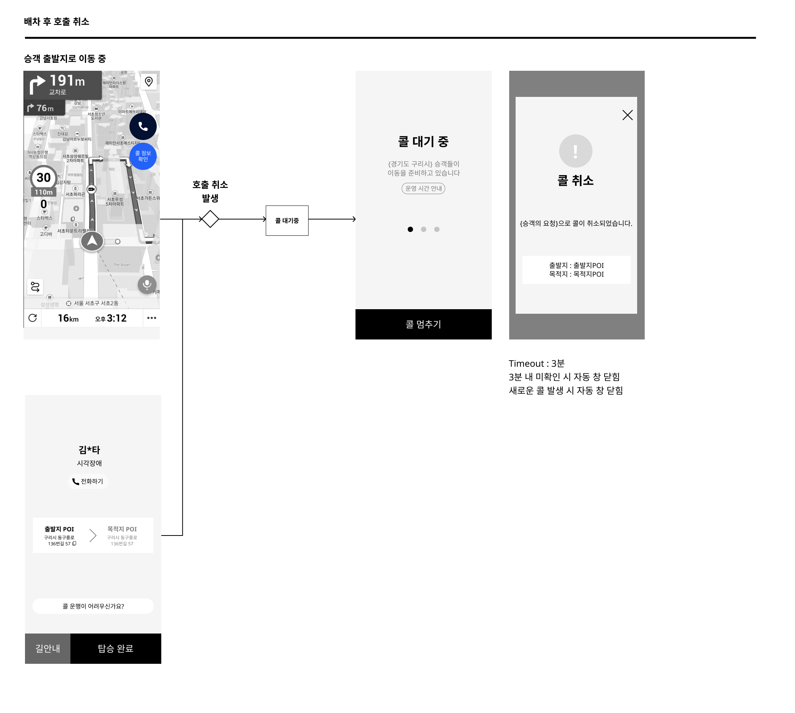

- `앱 푸시`와 `플로팅 버튼` 상태값을 통해 호출 취소 발생 여부를 즉각적으로 확인할 수 있다. 
- `앱 푸시` 또는 `플로팅 버튼`을 통해 기사앱으로 전환할 수 있다. 
- 기사앱 랜딩 시 `배차 대기` 상태로 랜딩한다. 

#### b. 콜 취소 팝업 구성 (🎄)

> 특정 콜에 대해서 호출 취소가 발생했음을 사용자에게 안내한다. 
> 취소 발생 사유를 안내하며, 호출 수수료 발생 여부는 별도 안내하지 않는다. (🎄)

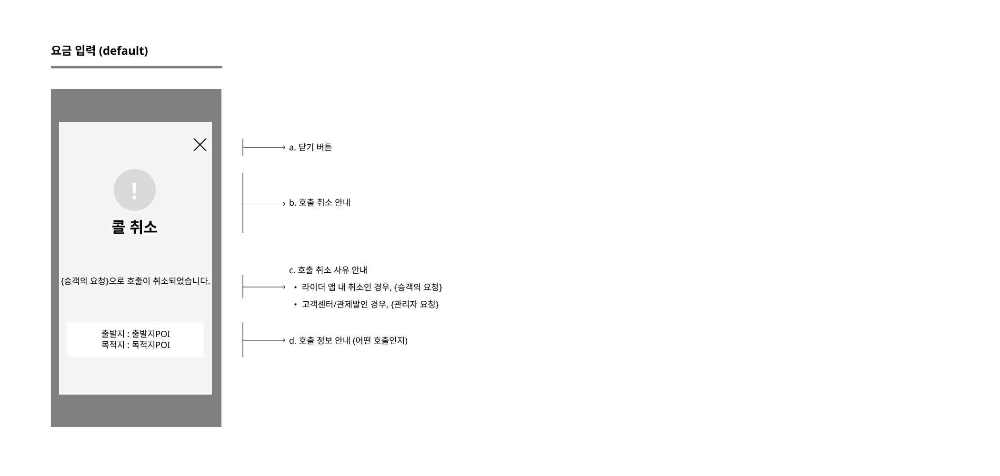

##### 닫기 버튼

- 선택 시 팝업 닫힘

##### 콜 취소 안내  (🎄)

- 콜이 취소되었음과 함께 취소 발생 사유를 함께 확인할 수 있다. 

  - 라이더앱 내 발생한 콜 취소 시, `승객의 요청`으로 콜이 취소되었습니다. 

  - 고객센터를 통한 콜 취소 시, `관리자 요청`으로 콜이 취소되었습니다.

##### 콜 정보 안내 

- 호출 정보를 판별할 수 있는 정보로 출발지와 목적지의 POI정보를 제공한다. 

##### Timeout

- Timeout 기준 : 3분
- `닫기 버튼`이나 `확인 버튼`을 선택하지 않더라도 3분 동안 해당 팝업을 확인하지 못했을 때는 자동 닫힘 처리한다. 

## (2) 목적지 안내 

> 목적지까지 이동할 수 있는 정보를 제공하며, 콜을 수행하기 어려운 상황에는 이동약자지원센터로 통화가 가능하다. 목적지 도착 시 요금 입력을 할 수 있다. 

### A. 플로우 (🎄v4.9.5)

#### a. 목적지 길안내 (🎄)

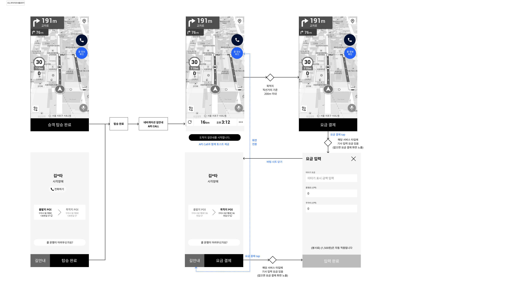

- 탑승 완료와 함께 **네비게이션 길안내** 화면으로 전환되며 카카오 네비게이션 SDK 길안내를 시작한다
  - 출발지 : 현위치 / 목적지 : 도착지 적용해서 API 콜 
  - API 콜 시점에 토스트 안내 제공 : 도착지 길안내를 시작합니다.
- **네비게이션 길안내** 화면에서 사용자가 원한다면, **목적지 안내** 화면으로 전환할 수 있다 
- **목적지 안내** 화면에서 사용자가 원한다면, **네비게이션 길안내** 화면으로 전환할 수 있다. 
- **네비게이션 길안내** 화면에서 목적지 인근에 도착 시 `요금 결제` 버튼이 추가 노출된다 (🎄)
  - 목적지 인근 기준 : 직선 거리 반경 200m 이내 
- **목적지 안내** 화면에서 상시적으로 `요금 결제` 버튼이 노출된다. (🎄)
- `요금 결제` 선택 시  (3) 요금 입력 화면 또는 (4) 요금 결제 화면으로 전환된다. (🎄)
  - 기준: 해당 서비스 타입의 기사 요금 입력 유무 

#### b. 네비게이션 뷰 전환 상세 

- (1) 출발지 안내 > A. 플로우 > b. 네비게이션 뷰 전환 상세와 동일

### B. 화면 구성

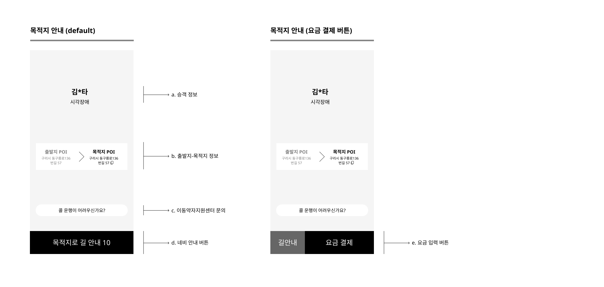

#### a. 승객 정보 

- 본인 확인 목적으로 승객 실명 정보를 노출하되 일부 글자를 마스킹 처리한다. 
- 장애 타입에 따라 차량 탑승을 돕기 위해 주장애 유형을 노출한다.

#### b. 출발지 - 목적지 정보

- 출발지 정보보다 목적지 정보가 더 주목성 높게 제공한다. 
- `POI명` + `도로명 주소`를 노출한다.
- 도로명 주소 정보는 사용자가 원한다면 복사 가능하다. 

#### c. 운영자 연락 버튼

- 관할 이동약자지원센터 전화번호로 전화 발신 
- 안심번호 미적용

#### d. CTA 버튼 : 목적지로 길안내 버튼

- 출발지는 `현위치`, 도착지는 `목적지`가 적용된 네비게이션을 실행한다. 
- 네비게이션에 위치를 보낼 때는 `좌표` 값을 기준으로 전달한다. 
- 10초 내에 버튼 선택 시에는 동일 화면에서 하단 CTA 버튼이  f. 요금 입력 버튼으로 자동 전환되며, 이 전환과 함께 티맵이 자동 실행된다. 
  - 티맵 기설치자는 티맵이 자동 실행된다. 
  - 티맵 미설치자는 별도 동작 없이 화면이 유지된다. 

- 10초 초과되어 타임아웃 됬을 때는 동일 화면에서 하단 CTA 버튼이  f. 요금 입력 버튼으로 자동 전환되며, 티맵이 실행되지 않는다.

#### e. CTA 버튼 : 티맵 + 요금 결제 버튼  (🎄)

- 티맵 버튼 선택 시, 출발지는 `현위치`, 도착지는 `출발지`가 적용된 네비게이션을 실행한다. 
  - 티맵 기설치자는 티맵에 실행된다. 

  - 티맵 미설치자는 구글 플레이 > 티맵 설치 페이지로 랜딩한다. 

- 요금 결제 버튼 선택 시 (3) 요금 입력 화면 또는 (4) 요금 결제 화면으로 전환된다. (🎄)
  - 기준: 해당 서비스 타입의 기사 요금 입력 유무 

## (3) 요금 입력

>  대부분의 경우 미터기 요금만 입력하고, 통행료, 주차비는 일부 케이스에서만 입력할 것이라는 가정으로 통행료, 주차비는 0원으로 기입력한 상태로 랜딩한다. 

### A. 노출 조건 (❄️v4.10)

- 해당 서비스 타입의 기사 요금 입력이 있는 경우에 한하여 노출
  > (v4.10) 의왕: Y / 영암: N / 영덕: Y

### B. 화면 구성 (❄️v4.10)

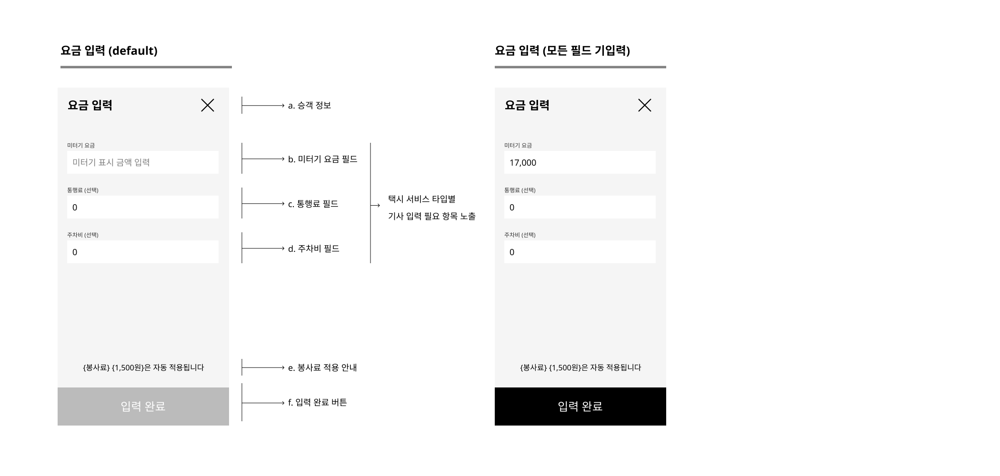

#### a. 요금 항목 (❄️v4.10)

- 서비스 타입에 따라 입력이 필요한 항목만 노출한다.
  - 호출 요금은 고정값이므로 입력 대상이 아니며, 결제 시 요금에 자동 적용된다.
    - 호출 요금이 0원이 아닌 경우에 한하여, {호출 요금명} 및 {호출 요금}을 안내한다.
    
      > (v4.10) 의왕: Y / 영암: Y / 영덕: N 
  
- 택시 서비스타입별 요금 입력 항목 (❄️v4.10)
  - 의왕: 미터기 요금, 통행료, 주차비

    - 미터기 요금 (필수) 
      - 디폴트로 빈 값 제공 
      - 필드 선택 시 값 변경 가능

    - 통행료 (선택)
      - 디폴트로 0원 적용
      - 필드 선택 시 값 변경 가능 

    - 주차비 (선택)
      - 디폴트로 0원 적용
      - 필드 선택 시 값 변경 가능
  - 영덕: 미터기 요금 (❄️)
    - 미터기 요금 (필수)
      - 의왕과 동일

~~ ❄️

#### b. CTA 버튼

- 모든 필수 요금 필드 입력 시 하단 버튼 활성화 처리된다.

### C. 요금 입력 상한선 설정

#### a. 필드별 상한선 금액

| 필드명      | 상한 기준 금액 |
| ----------- | -------------- |
| 미터기 요금 | 100만원        |
| 주차비      | 10만원         |
| 통행료      | 10만원         |

#### b. 동작 정의 

- 상한 기준 금액 이상의 숫자를 입력 시도 시 입력 불가 
- 동시에 에러메시지를 토스트로 노출 
- 이 때. 입력 필드에 있던 값은 그대로 유지
  - 예) 미터기 요금 1,100,000 입력 시도 시 110,000을 입력하고 0을 추가 입력하려고 할 때 토스트 노출되고 필드는 110,000으로 유지

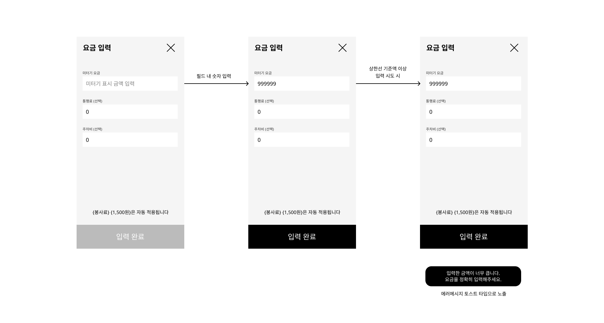

### D. [예외] 중도 하차 발생 시 

#### a. 플로우 

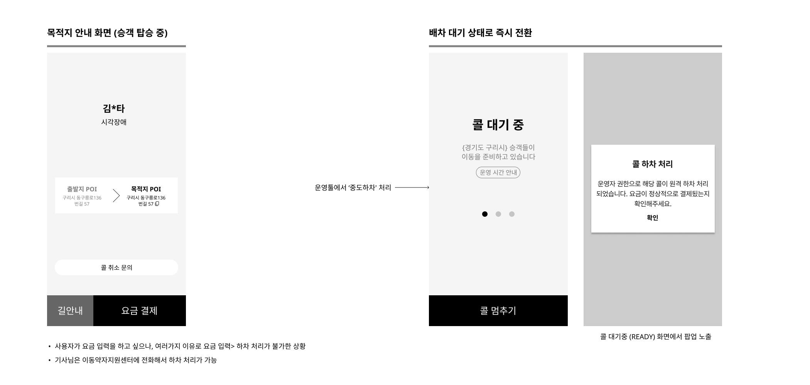

- 기사가 요금 입력을 하고 싶으나, 여러가지 기술적, 상황적 이유로 요금 입력> 하차 처리가 불가한 상황일 때

- 기사님은 이동약자지원센터에 전화해서 하차 처리가 가능

- 운영툴에서 중도하차 처리 시, 기사앱에서는 현재 화면에서 배차 대기 상태로 화면이 전환된 후 하차 처리 안내 팝업이 노출된다. 

## (4) 요금 결제 (❄️v4.10)

> 결제를 진행하기 위한 화면을 제공한다. 
> 항목별 요금을 확인하고(사용자가 입력한 요금 정보 포함), 결제 수단별 필요 task를 수행할 수 있다. 

### A. 화면 구성 (❄️v4.10)

#### a. 총 결제 금액 (🎄)

- 실제 승객이 지불해야하는 금액 (택시 서비스 타입별 요금/할인 항목의 합산 값)
- tooltip 노출
  - `승객 결제 요금은 지역별 서비스 정책에 의하여 산정되며, 실제 매출과 다를 수 있습니다.`

#### b. 요금/할인 항목 (🎄)

- 택시 서비스 타입별 요금/할인 항목과 그 값
  - 택시 서비스 타입별 요금/할인 항목을 모두 노출하며, 특정 항목이 0원인 경우 `0원`으로 노출

#### c. 결제 수단에 따른 문구 및 cta (🎄)

- 선택된 결제 수단에 따른 문구 및 cta 노출 (결제 수단 변경 불가능)
  - [앱 결제] 선택 시
    - 안내 문구
      - `입력한 요금이 맞나요? ` (🎄🎄)
  
    - btn
      - `결제 요청`: 선택 시, 자동 결제 시도 화면 노출
      - 닫기(X)
  
  - [현장 결제] 선택 시
    - 안내 문구
      - `현장 결제 승객입니다. 직접 결제를 요청해주세요 ` (🎄🎄)
  
    - btn
      - `다음 콜 받기`: 선택 시, 수납 처리 후 [콜 대기] 화면 진입 
      - 닫기(X)
        

### B. 요금 결제 정책 (❄️v4.10)

#### a. 결제 수단 종류 
##### 바우처 결제 (❄️)
- 이동약자지원센터에서 지원해주는 교통 약자 바우처 금액만큼 결제
  - 경기도 장애인 바우처의 경우, 15,000원 값 고정
  
- 정산 주체 : 이동약자지원센터

- 정산 기간 : 결제 시점 D+3이내

  > (v4.10) 바우처 결제 지원 서비스 타입: 의왕, 영암, 영덕
##### 앱 결제 (❄️)
- 승객이 기등록한 결제 카드로 자동 결제 진행

- 정산 주체 : 정산사(이즐)

- 정산 기간 : 결제 시점 D+3이내

  > (v410 앱 결제 지원 서비스 타입: 의왕, 영덕

##### 현장 결제

- 차량 내에서 승객의 카드 또는 현금으로 직접 결제

- 별도 정산 없이 기사가 직접 수취

  > (v4.10) 현장 결제 지원 서비스 타입: 영암

#### b. 총 결제 금액 (❄️)

##### 총 결제 금액 

- 택시 서비스 타입별 요금 항목별 발생 금액(+)과 바우처 할인(-)의 합산 값

  >  (v4.10) 택서타별 총 결제 금액
  >
  > - 의왕: 미터기 요금 + 주차비 + 통행료 + 봉사료({호출 요금}) + 바우처 할인(-)
  >
  > - 영암: 거리 기준 요금 + 기본 요금({호출 요금}) + 바우처 할인(-)
  > - 영덕: 미터기 요금 + 바우처 할인(-)

#### c. 요금/할인 항목 (❄️)

##### 요금 항목(+) : 거리 기준 요금, 미터기 요금, 주차비, 통행료, {호출 요금}

- 택시 서비스 타입별 하위 요금 항목을 달리한다.

| 항목명         | 비고                             | 바우처 차감 | 의왕   | 영암   | 영덕 (❄️) |
| -------------- | -------------------------------- | ----------- | ------ | ------ | -------- |
| 거리 기준 요금 | 관제 등록 값(바우처 요금)        | 가능        | 노출 N | 노출 Y | 노출 N   |
| 미터기 요금    | 기사 입력 값                     | 가능        | 노출 Y | 노출 N | 노출 Y   |
| 주차비         | 기사 입력 값                     | 불가능      | 노출 Y | 노출 N | 노출 N   |
| 통행료         | 기사 입력 값                     | 가능        | 노출 Y | 노출 N | 노출 N   |
| {호출 요금}    | 관제 등록 값(택서타별 호출 요금) | 불가능      | 노출 Y | 노출 Y | 없음     |

##### 할인 항목 (-) : 바우처 할인 

- 택시 서비스 타입별 정책에 따른 정액/정률 할인을 적용한다.
- `바우처 차감이 가능한 요금 항목`에 한하여 `최대 한도 금액`까지 바우처로 결제할 수 있다.
  - 나머지 금액(초과 이용 요금)은 앱/현장 결제한다.
    - 앱 결제인 경우 초과 이용 요금을 분할 결제하지 않고 한번에 PG 결제한다.

~~❄️

## (5) 결제 요청 및 결과

> 결제 요청이 완료된 시점에 피드백을 제공한다. 

### A. 결제 플로우 (🎄v4.9.5)

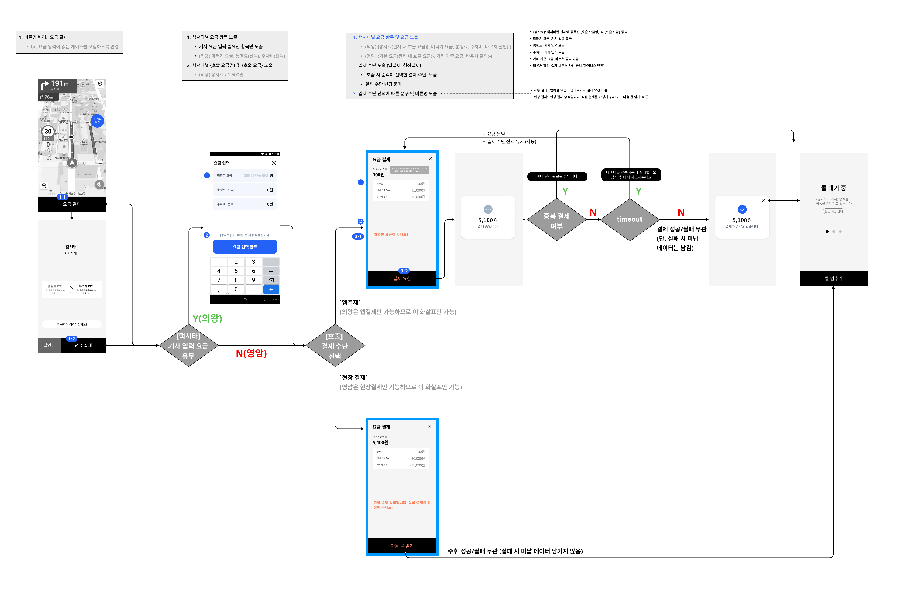

- 중복 결제 여부 체크 : 동일 demand ID에 대해서 결제 요청 건이 있는지 체크하고, 중복 결제 건인 경우 에러 토스트를 노출하고 배차 대기 상태로 전환한다.
- timeout 체크 : 일정 시간 내 서버에 결제 요청을 완료하지 못한 경우, 토스트를 통해 데이터 전송 실패에 대해 안내하고 요금 입력 화면으로 랜딩한다. 
- PG 성공 여부 체크 : 승객 결제 카드의 PG 결제 성공 여부와 상관 없이, 서버에 결제 요청 전송을 완료하면, 결제 완료 팝업을 제공하고 해당 demand를 하차 처리한다.
- 승객이 선택한 결제 수단으로 결제를 진행하며, 결제 수단을 변경할 수 없다. (🎄🎄)

### B. 자동 결제 화면 구성 (🎄v4.9.5)

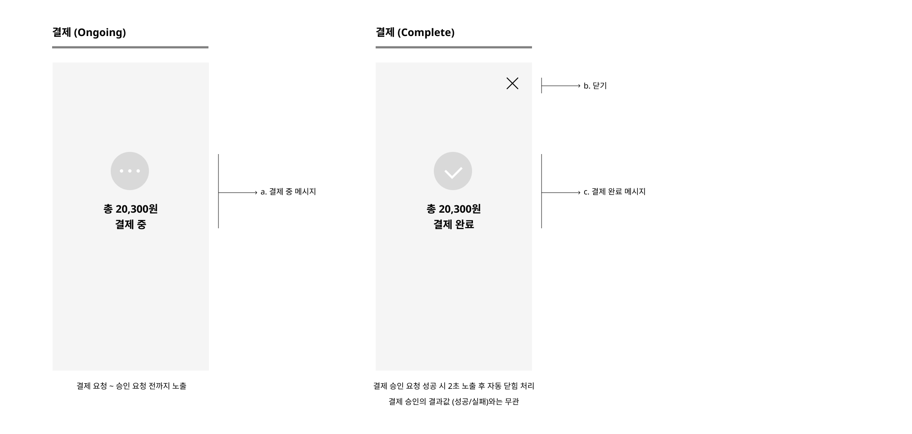

#### a. 결제 시도 중 (🎄)

- 결제가 진행 중일 때는 결제 중 메시지만 노출되며, 앱 내 다른 화면으로 이동이 제한된다.
- 총 결제 금액을 노출한다. 

#### b. 결제 시도 후(🎄)

##### 결제 성공

- 총 결제 금액 및 결제 완료 메세지, 닫기 버튼을 노출한다. 
  - `닫기`버튼 선택 시, [콜 대기] 화면으로 전환되어 새로운 콜을 배차받을 수 있다. 
- 결제 승인 요청 성공과 함께 해당 demand의 상태값이 `하차 완료`로 전환된다
- 결제 승인 요청 성공 후 2초 이후에 자동으로 팝업이 닫힘 처리된다. 

##### 결제 실패 (🎄🎄)

- 총 결제 금액 및 결제 완료 메세지, 닫기 버튼을 노출한다. 
  - `닫기`버튼 선택 시, [콜 대기] 화면으로 전환되어 새로운 콜을 배차받을 수 있다. 
- 결제 실패 확인 시점에 해당 demand의 상태값이 `하차 완료`로 전환된다.
  - 위 시점에 DB에 미납 데이터를 남긴다.

- 결제 실패 확인 후 2초 이후에 자동으로 팝업이 닫힘 처리된다. 

~~🎄

## (6) 예외 정의

> 콜 수락 ~ 결제 관련해서 예외 상황에 대해 정의한다. 

### A. 콜 수락 후 타임 아웃 

#### a. 정의

- 콜 수락 후 24시간 동안 하차 처리되지 않을 경우, 자동으로 하차 처리하고, 결제 금액은 0원으로 처리한다.    
- 예시 ) 12/1 오전 10시에 수락한 콜에 대해서 하차 처리되지 않은 채로 12/2 오전 10시에 도래하면, 해당 콜을 하차 처리하고, 결제 금액은 0원으로 처리한다. 

#### b. 기능 동작 

- 타임 아웃 시점에 해당 기사 회원에게 푸시 노티 제공
- [푸시 알림 기획서 바로 가기](https://github.com/hkmc-airlab/shucle-DriverVehicle-product/blob/master/Voucher%20Taxi%20Driver%20App/05.%EA%B3%B5%ED%86%B5.md#3-%EC%95%8C%EB%A6%BC) 
