# 04. 메뉴 (🍡v4.11)(❄️v4.10)

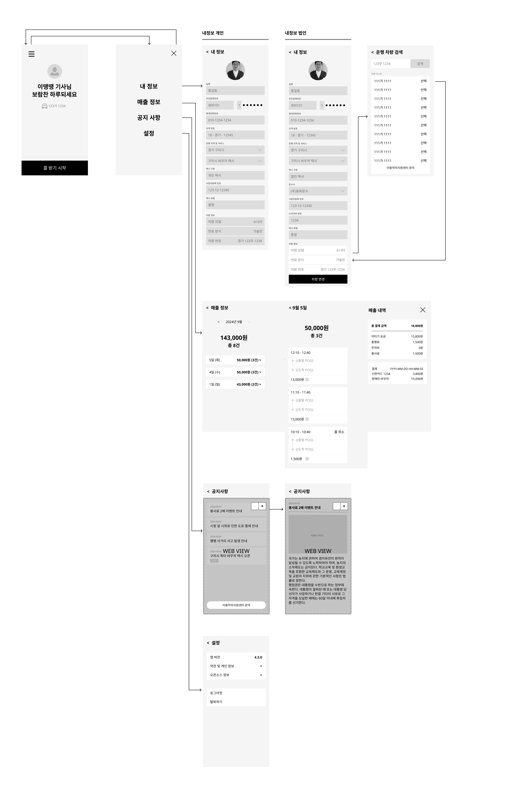

## (1) 메뉴 

> 사용자가 내 정보 차량 정보, 매출 정보, 공지사항 등을 확인할 수 있는 동선을 제공한다. 안전을 위해 운행 준비 상태에서만 동선을 고려한다.

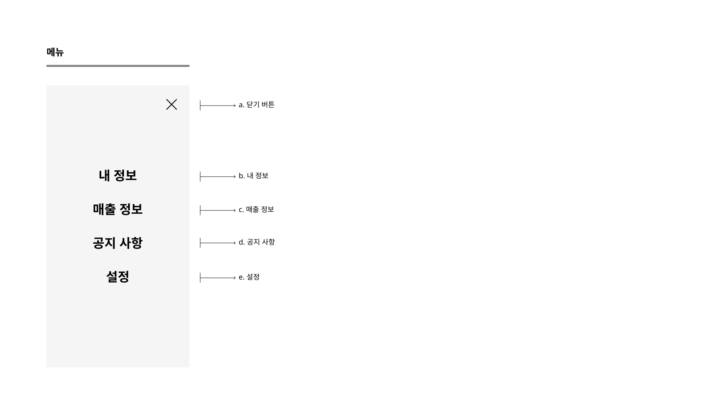

## (2) 내 정보 

> 회원 가입 시 등록된 정보를 확인할 수 있고, 수정은 불가하다. 

### A. 개인 회원 (🎄v4.9.5)

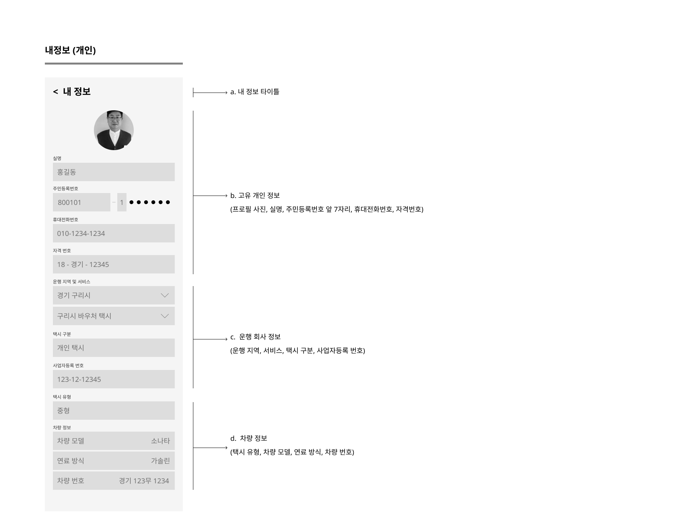

- 가입 시 승인된 회원 정보에 대해 확인 가능 
- 수정 불가능, 수정 원할 시 운영자 연락

### B. 법인 회원 (🎄v4.9.5)

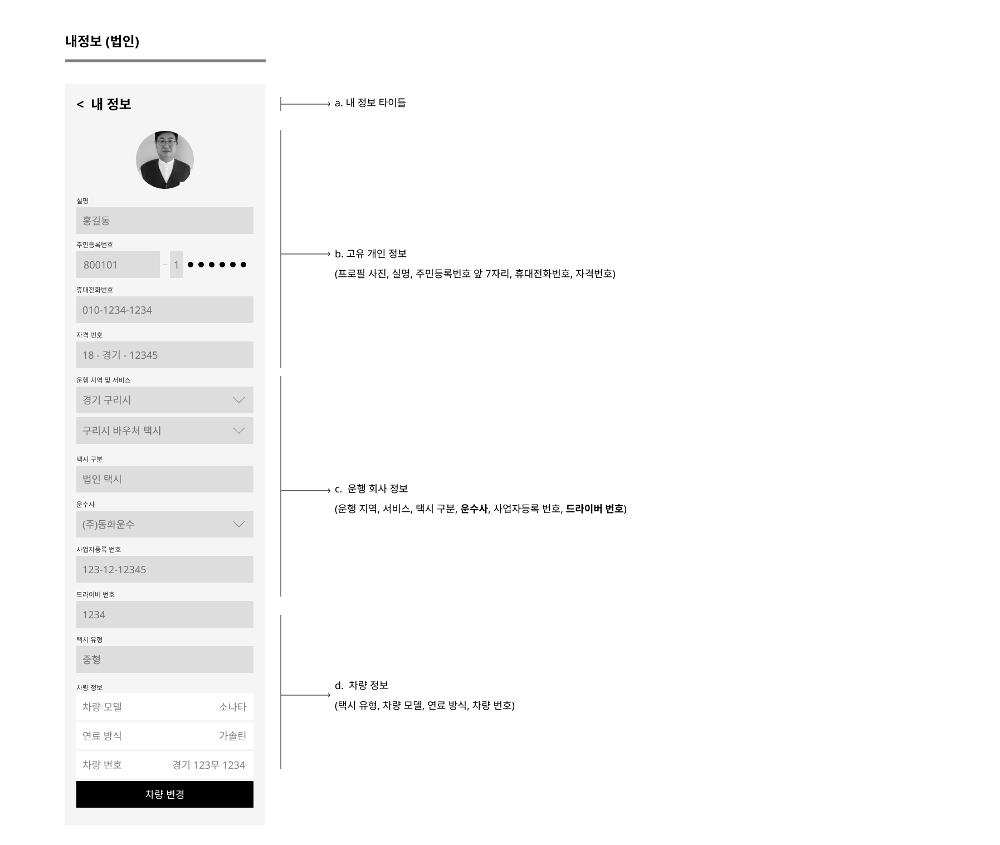

- 가입 시 승인된 회원 정보에 대해 확인 가능 
- 차량 번호 제외하고 수정 불가능, 수정 원할 시 운영자 연락
- 차량 번호는 운수사 보유 차량 리스트에서 선택 가능

####  a. 차량 변경

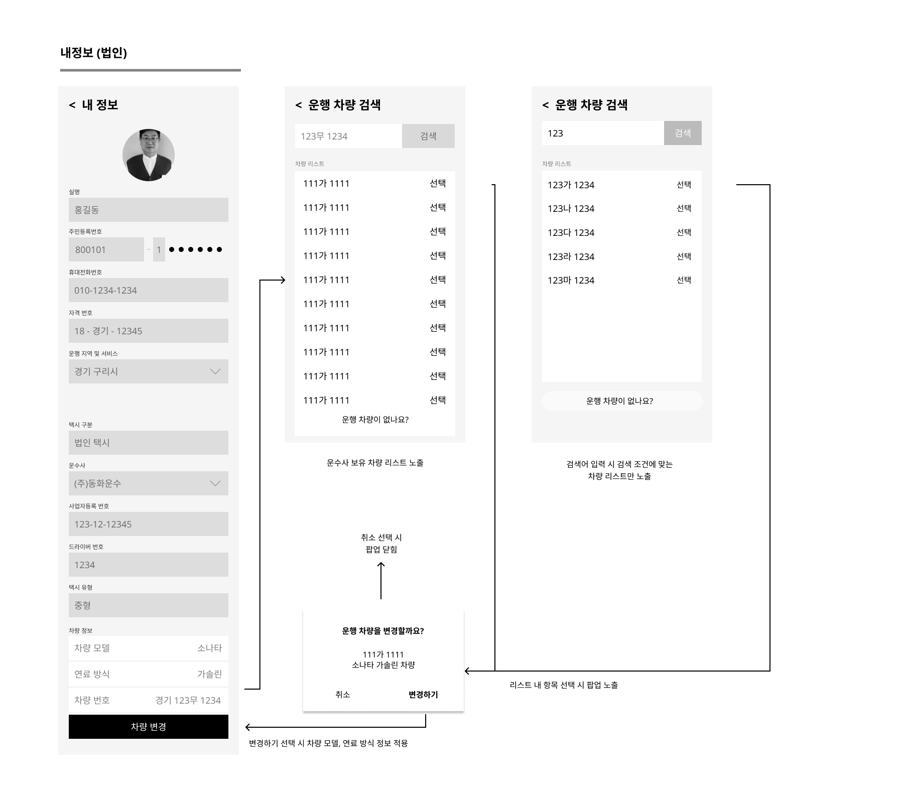

- 차량 변경 플로우는 법인 가입 > 운행 차량 등록 동선과 유사하다.
- 리스트에서 변경하고자 하는 차량 선택 시 컨펌 팝업을 노출한다. 
  - 변경 전 컨펌 팝업에서 차량 번호와 차종, 연료 타입을 확인할 수 있다.

## (3) 매출 정보 

> 운행을 통해 발생한 월별 / 일별 호출 건수와 매출을 확인할 수 있다.

### A. 월별 매출 정보

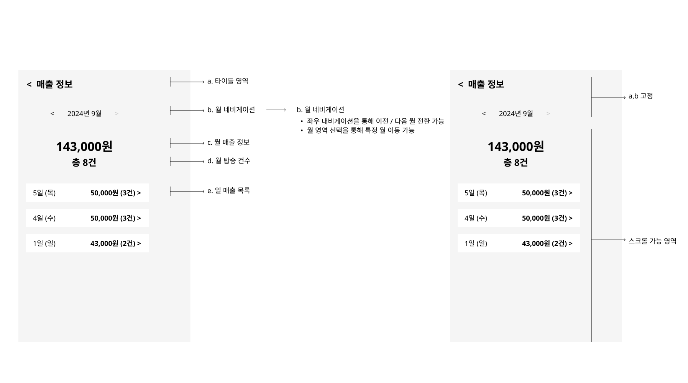

- 월 기준으로 모든 호출 건에 대한 운행 정보와 매출 내역 확인 가능
- 가입일 포함 월 ~ 오늘 포함 월 까지 탐색 가능 

#### a. 월 네비게이션

- 현재 월로 랜딩 
- 이전/다음 월 네비게이션 가능 
- 노출 형식 : yyyy년 mm월
- 열람 가능 월 기준 : 가입일 포함 월 ~ 현재 월

##### 월 선택 피커 동작

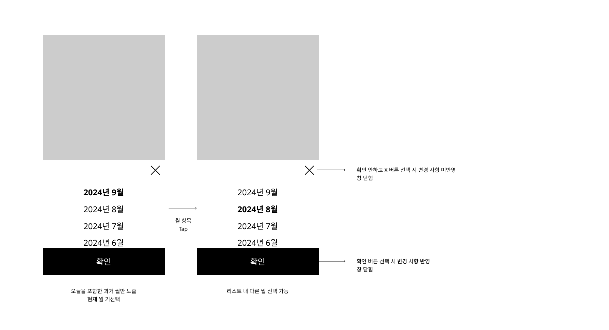

#### b. 월 매출

- 당월 발생한 일 매출의 합

#### c. 월 호출 건수

- 당월 발생한 호출 건의 합 
- 배차 후 모든 호출 건을 포함함 
  - 호출 취소 건 중에는 매출이 발생한 건 포함 
  - 1분 내 호출 취소는 미포함, 1분 후 호출 취소는 포함

#### d. item 정렬 기준

- 최신순으로 호출 건이 있는 일만 노출 

#### e. item 구성 

- 일 정보 : d일 ({요일명})
- 일 매출 : {{당일 발생한 호출의 총 매출의 합}} 원 ({{당일 발생한 호출 수}}건)
  - 단, 당일 발생한 호출 수에서 콜 취소 건 중 매출이 0인 항목은 노출하지 않는다. 

### B. 일별 매출 정보

#### a. 화면 정의

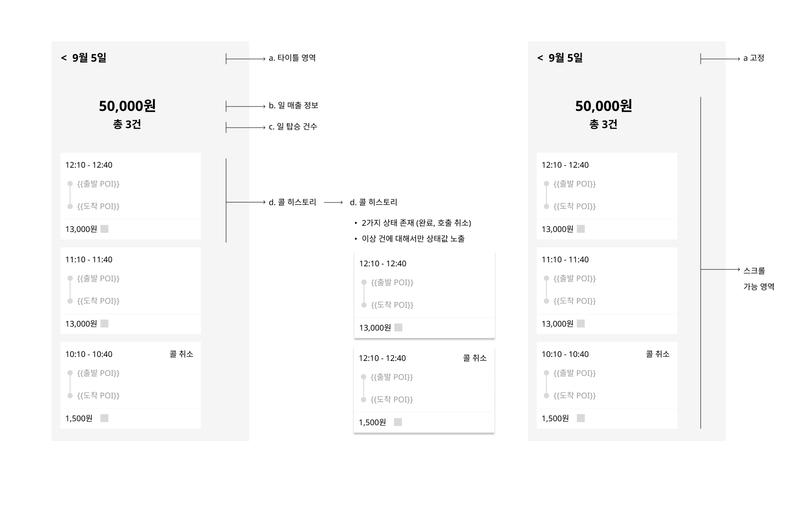

- 일 기준으로 매출이 발생한 모든 호출 건에 대한 운행 정보 확인 가능

##### 일 네비게이션

- 선택한 일로 랜딩 
- 노출 형식 : mm월 dd일
- 열람 가능 일 기준 : 최초 호출 건 발생 일 ~ 현재 일

##### 일 매출

- 당일 발생한 일 매출의 합

##### 일 호출 건수

- 당일 발생한 호출 건의 합 
- 배차 후 모든 호출 건을 포함함 
  - 단, 기사 매출이 발생하지 않는 1분 내 호출 취소 건은 미노출 

##### 호출 카드 정렬 기준 

-  호출 시점 기준 최신순으로 노출  

##### 호출 카드 상태

###### 콜 완료

- 시간 : 호출 시점(HH:MM) - 하차 시점(HH:MM)
- 호출 상태 : 미노출
- 승차 정보 
  - 승차 POI
- 하차 정보
  - 하차 POI
- 총 매출 
  -  서비스 타입별 하위 요금 항목의 합산 값

###### 콜 호출 취소 (1분 후)

- 지불한 요금이 발생한 경우에 한하여 노출
- 시간 : 호출 시점(HH:MM) - 취소 시점(HH:MM)
- 호출 상태 : 취소
  - 오픈 스펙으로는 승객 취소 건만 고려
- 승차 정보 
  - 승차 POI
- 하차 정보
  - 하차 POI
- 총 매출
  - 콜 취소 수수료
  

#### b. 상태별 화면 상세

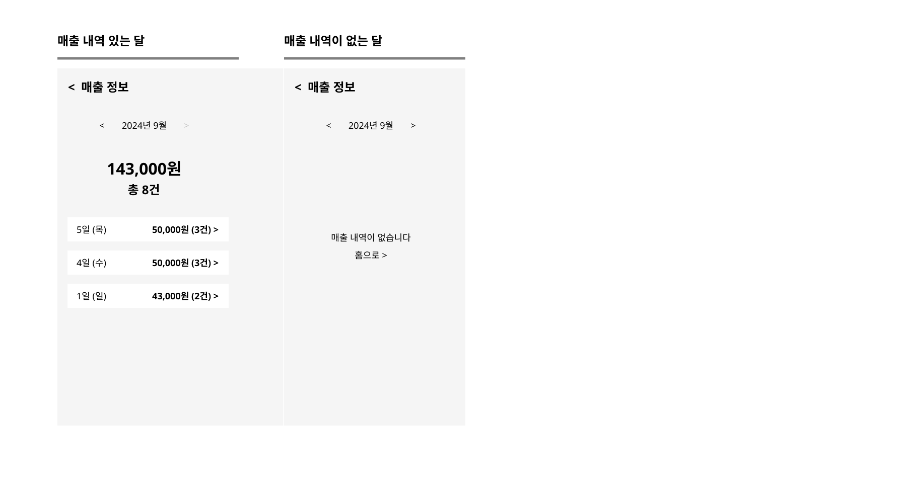

#### c. 예외 케이스 
##### 호출 발생일과 결제 발생일이 상이한 경우 
- 현재 서비스 정책에 따르면 호출 발생일이 한참 지난 후에도 결제 수정(취소, 재결제)이 가능
- 과거 호출 건에 대해서 결제 변경이 일어났을 때 호출 기준으로 결제 기록을 남긴다. 
- 예를 들어 8/30 호출 건에 대해서 9/2 결제 수정이 발생한 경우 기대 결과는 다음과 같다. 
  - 8/30 일 매출 정보 > 해당 호출 카드 내 금액 변경 
  - 8/30 일 매출 정보 > 매출 상세 내 총 결제 금액 변경, 항목 추가
  - 9/2 일 매출 정보 > 변경 없음 
  - 8월 월 매출 정보 변경 
  - 9월 월 매출 정보 변경 없음

### C. 호출 매출 정보 (🍡v4.11)(❄️v4.10)

#### a. 화면 정의 (❄️)
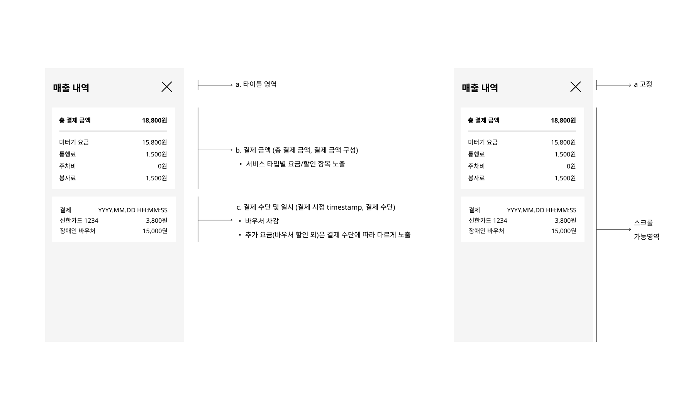

##### 결제 항목 (❄️)

- 택서타별 이용 요금 항목 및 요금
  - 요금 항목: 택시 서비스 타입별 상이
    - 의왕: 미터기 요금, 통행료, 주차비, 봉사료({호출 요금})
    - 영암: 거리 기준 요금, 기본 요금({호출 요금})
    - 영덕: 미터기 요금(❄️)

##### 결제 시점 (🎄)

- [앱 결제] 기사앱에서 결제 요청이 성공된 시점 (PG 기준이 아니라 서버 기준)
- [현장 결제] 기사앱에서 `다음 콜 받기` 버튼을 선택한 시점

##### 취소 시점

- [앱 결제] 운영툴에서 취소 요청이 성공된 시점  (PG 기준이 아니라 서버 기준)

##### 재결제 시점 

- [앱 결제] 운영툴에서 재결제 요청이 성공된 시점  (PG 기준이 아니라 서버 기준)

#### b. 상태별 화면 상세 (🍡)(❄️)

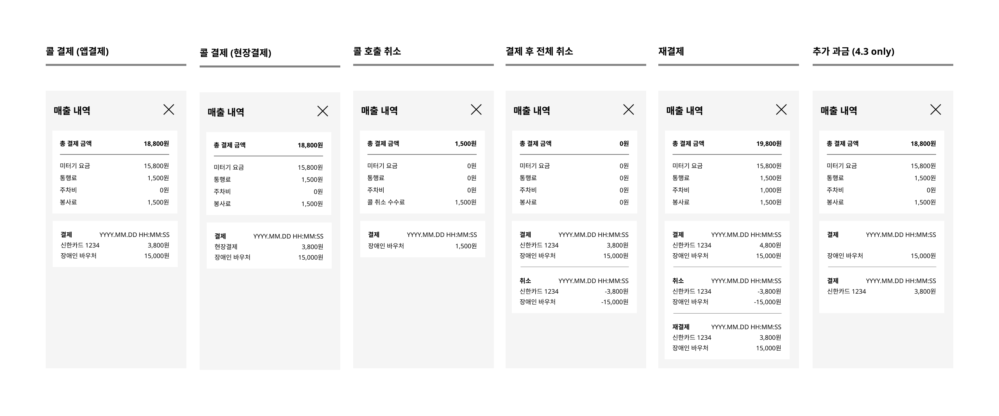

- 결제 항목에는 '요금 항목' 및 '항목별 금액'노출 
  - 항목별 입력 여부와 상관 없이 택시 서비스 타입별 고정 항목을 노출
    
  - 단, 콜 취소 건은 지불한 요금이 발생한 경우에 한하여 노출 (❄️)
    > Case A) 취소 수수료 발생 
    >
    > Case B) 탑승 이후 취소(관제) & 요금이 발생하는 경우
    
  - 운영툴에서 추가 과금, 결제 취소 하더라도 항목 목록은 변경되지 않음
  
- 결제 정보에는 '결제 수단' 및 '결제 수단별 금액' 노출 (🍡)
  
  > [정책]
  >
  > - (앱 결제) 기사님은 앱 결제 성공 여부를 알 수 없으며, 미수금 발생과 무관하게 전체 요금을 정산 받음
  > - (현장 결제) 기사님은 현장 결제 성공 여부를 알 수 있지만, 미수금 발생 여부를 앱에 등록하지 않음(수취 의사 없음)
  > - 따라서, 기사앱 내 미수금 발생 또는 해결에 대한 정보를 제공하지 않음
  
  - 결제 내역은 시간 순으로 노출 (과거 데이터가 상단에 위치)
  - 해당 결제에 사용된 결제 수단(앱 결제/현장 결제/바우처 차감)을 노출 (🍡)
    - A. 승객 지불 요금이 있다면
      - A-1. 앱 결제인 경우, `앱결제` 및 '금액' 노출
      - A-2. 현장 결제인 경우, `현장 결제` 및 '금액' 노출 
    - B. 바우처 거래 건이 있다면, '바우처 이름'과 '금액' 노출
    - 단, PG/현장 수취 및 바우처 거래 건이 모두 있다면, A,B 리스트로 노출 (🎄)

~~ 🍡

### D. 드라이버의 요금 오입력 운영 정책 (🎄v4.9.5)

- 현재 스펙 상 요금 정보 입력 시 기사가 입력되는 데로 결제되는 방식 
- 드라이버가 요금을 오입력하는 경우, 원래 지불해야 하는 요금보다 더 많이 또는 더 적게 결제되는 문제 발생
- 해당 케이스일 때는 운영자가 운영툴에서 해당 호출 건의 총 요금을 전체 취소를 하고 다시 재결제를 실시
- 재결제 시 기존 요금 항목 (택시 서비스 타입별 항목을 따름) 에 대하여 입력 가능 (🎄)

~~🎄

## (4) 공지사항

> 내 운행 지역에서 발생하는 교통 관련 소식, 이벤트, 공지 사항 등을 확인할 수 있으며, 주로 이동약자지원센터가 관리한다.

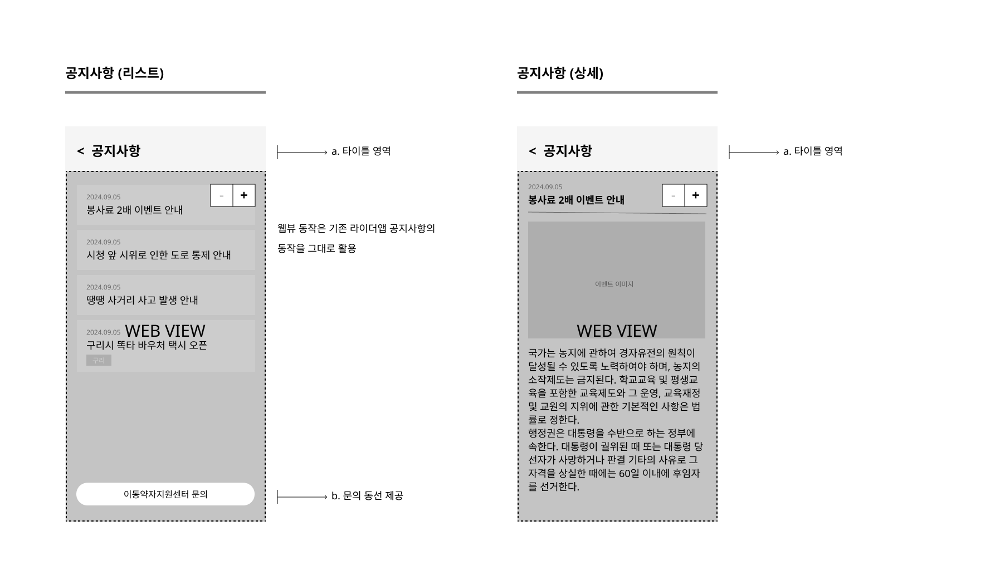

- 이동지원센터 연락 플로팅 버튼 제공

- 소속 운행 지역 공지사항만 노출 : 운행지역이 구리이면, 구리시 공지만 노출

- 기존 라이더앱에 적용된 공지 웹뷰와 동일한 형태로 동작

  

## (5) 설정 (🎄v4.9.5)

> 기타 서비스/앱 지원 정보를 확인할 수 있다. 

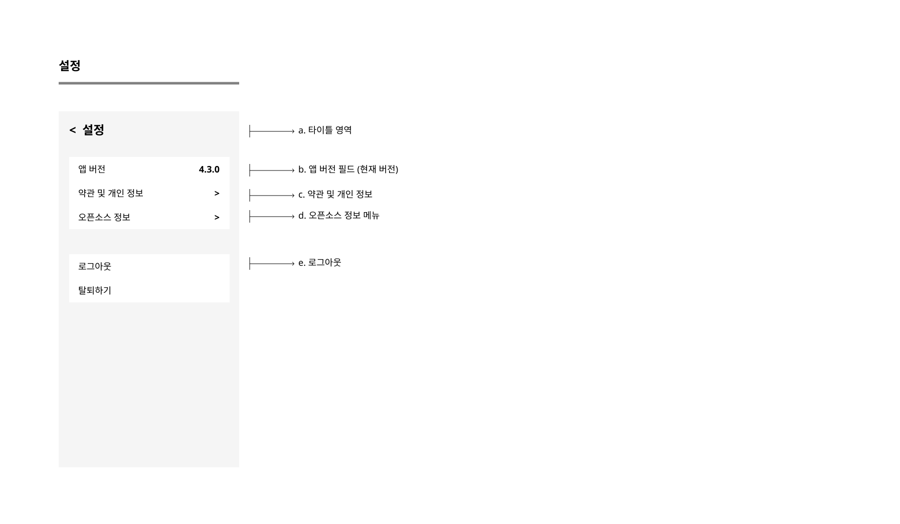

### A. 현재 앱 버전

- CS 응대 등의 상황에 대비하여 현재 앱 버전 확인 가능하다

### B. 오픈 소스 정보

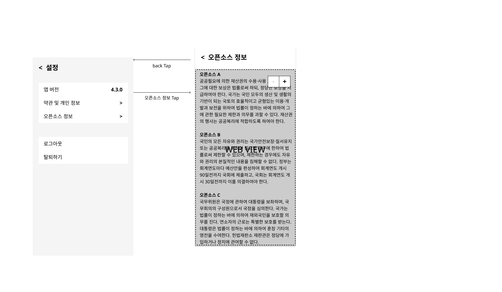

- 오픈 소스 정보 확인이 가능하다
- 랜딩 페이지는 웹뷰로 관리한다. 

### C. 로그 아웃

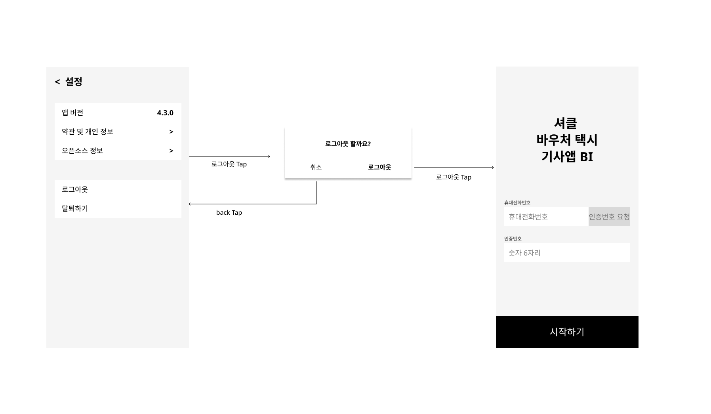

- 로그아웃 가능하다. 

### D. 서비스 탈퇴 

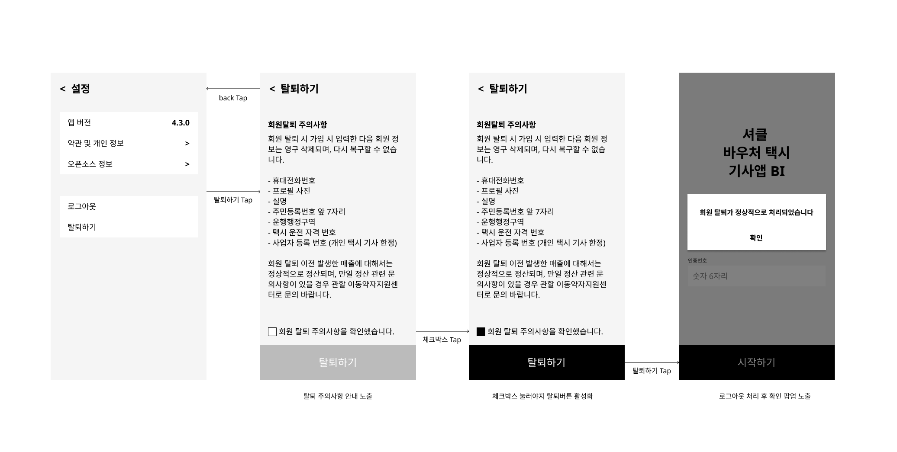

### D. 약관 및 개인정보 (🎄v4.9.5)

- 관제에 등록된 약관 중 `시행 중`인 약관 리스트를 노출한다.
  - 리스트는 Webview로 노출
  - [참고] 관제 내 등록 경로: 플랫폼 > 약관 > 셔클 > 기사앱 가입  
- 특정 약관 선택 시, 해당 약관 전문을 노출한다. 
  - 전문은 Webview로 노출

~~🎄
