# 05. 공통

## (1) 플로팅 버튼
### A. 활용 목적
- 사용자가 타 앱 서비스를 사용할 때 쉽게 우리 서비스로 전환할 수 있다
- 플로팅 버튼을 통해 현재 진행 중인 콜의 주요 상태를 확인할 수 있다
### B. 상태
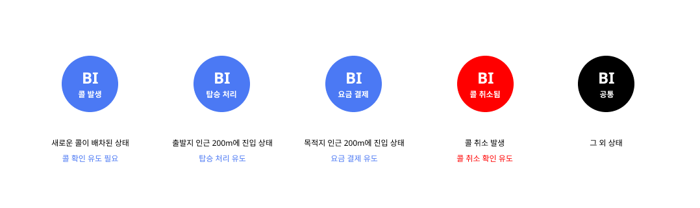

### C. 상태별 랜딩 화면 (🎄v4.9.5)
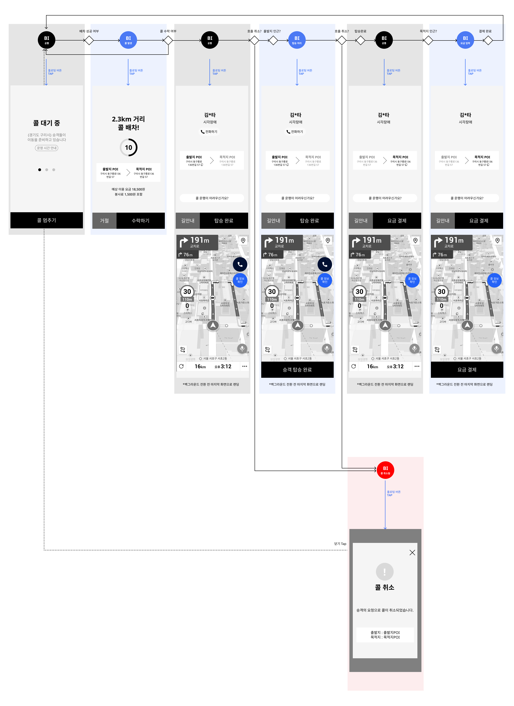

#### 플로팅 버튼 타입 

| 플로팅 버튼 타입         | 생성 조건                                                    | 삭제 조건                                                    |
| ------------------------ | ------------------------------------------------------------ | ------------------------------------------------------------ |
| (1) 콜 발생              | 1개 이상의 demand의 배차 Q에 해당 supply 포함 시             | - 20초 타임아웃 초과 시  - or 타 기사가 해당 demand 수락 시 |
| (2) 탑승 처리            | 출발지 직선 거리 기준 200m 이내 진입 시                      | - 탑승 처리 완료 시   - or (4) 이벤트 발생 시            |
| (3) 요금 결제 (🎄)        | 목적지 직선 거리 기준 200m 이내                              | - 요금 결제 완료 시 (🎄)                                      |
| (4) 콜 취소됨            | 콜 수락 후 호출 취소 발생 시  (라이더앱 / 운영툴 발 호출 취소 모두 포함) | - 앱 진입 시 - or (1) or (2) or (3) 이벤트 발생 시  - or 콜 취소 발생 후 3분 초과 시 |
| (5) 그 외 상태 (default) | (1), (2), (3), (4) 플로팅 버튼 생성 조건 불만족 시           | (1), (2), (3), (4) 이벤트 발생 시                            |

#### 네비게이션 화면 랜딩 로직 

- 콜 수락 ~ 결제 완료 시, 출발지 POI 또는 도착지 POI로 인앱 네비게이션으로 길안내를 제공할 수 있다. 
- 플로팅 버튼을 선택하여 앱에 재진입할 때, (1) 네비게이션 안내 화면 (2) 출발지 / 도착 안내 화면 중 마지막 유지 화면으로 랜딩한다.

### D. 노출 및 위치 조정

- (5) default 상태에서 플로팅 버튼의 위치를 사용자가 원하는 곳으로 조정할 수 있다.
  - 상세 동작은 디자인 가이드 참조 필요 
- 플로팅 버튼의 생성과 앱 실행은 항상 페어로 진행된다. 
  - 앱 실행 중 플로팅 버튼의 임의 삭제는 불가하다.
  - 앱 종료 후 플로팅 버튼의 임의 노출은 불가하다. 

## (2) 공통 에러 토스트

### A. 종류
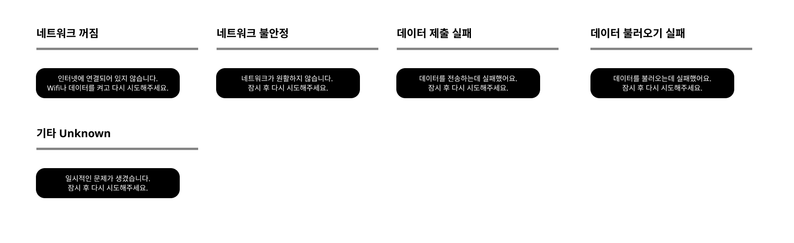

#### a. 네트워크 꺼짐 
- 디바이스에서 데이터나 Wifi가 켜지지 않은 상태에서 데이터 송수신 시도 시
#### b. 네트워크 불안정
- 데이터나 Wifi는 켜져있지만 네트워크 송수신 상태가 불안정해서 요청한 작업을 완료할 수 없을 때 
#### c. 데이터 제출 실패 
- 데이터를 서버에 전송하는 작업을 실패했을 때 
- 용례 : 온보딩 가입정보 제출 시, 요금 입력 시
#### d. 데이터 불러오기 실패 
- 데이터를 서버에 전송하는 작업을 실패했을 때 
- 용례 : 정산 정보 불러올 때

#### e. Unknown 

- 그 외 알 수 없는 오류가 발생했을 때

  

### B. 체크 시점 

- [공통] 서버 송수신 시도 시점에 2s 노출

## (3) 알림

###  A. 알림 종류

| 케이스              | 푸시 메시지                                                  |
| ------------------- | ------------------------------------------------------------ |
| 콜 배차 시          | [셔클 기사앱] {{출발지}}에서 새로운 콜이 배차됐어요.         |
| 승객 콜 취소 시     | [셔클 기사앱] {{출발지}}로 이동 중에 콜이 취소됐어요.        |
| 출발지 인근 도착 시 | [셔클 기사앱] 출발지에 거의 다 도착했어요. 승객에게 확인 전화를 걸어보세요. |
| 목적지 인근 도착 시 | [셔클 기사앱] 목적지에 거의 다 도착했어요. 미터기 요금과 기타 요금을 잘 확인하고 입력해주세요. |

### B. 알림 동작

#### 알림의 생성 

- 알림은 해당 이벤트 발생과 동시에 생성된다. 
- 알림은 앱이 백그라운드 실행 시에만 발생하고, 포그라운드 실행 시에는 발생하지 않는다. 
  - 단, 앱이 백그라운드 실행 시 발생한 알림은 포그라운드 전환 시에도 유지된다.

- 알림은 플로팅 버튼의 상태 값과 더불어 기사님께 특정 이벤트 발생을 안내하는 역할을 하며, 일시적으로만 제공된다. 

#### 알림의 삭제 

- 알림은 각 이벤트 별로 유지 기간과 조건이 상이하며, 해당 기간이 만료되거나 조건이 유효하지 않는 즉시 자동 삭제 처리된다. 
- 해당 유지 기간은 기사앱 포그라운드 상태에서 유지 시 노출되는 팝업의 유지 기간과 동일하다. 

| 케이스              | 푸시 유지 기간  | 푸시 유지 조건                                          |
| ------------------- | --------------- | ------------------------------------------------------- |
| 콜 배차 시          | 콜 배차 후 20초 | -                                                       |
| 승객 콜 취소 시     | 콜 취소 후 3분  | -                                                       |
| 출발지 인근 도착 시 | -               | 출발지 인근 200m 도착 시부터 탑승 완료 처리 전까지      |
| 목적지 인근 도착 시 | -               | 도착지 인근 200m 도착 시부터 요금 결제 완료 처리 전까지 |

## (4) 공지 팝업 

### A. 공지 팝업 타입

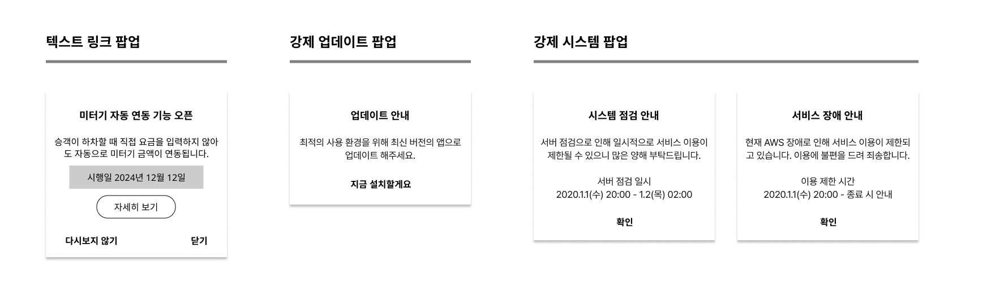

### B. 팝업 상세 구성
#### a. 텍스트 링크 팝업 

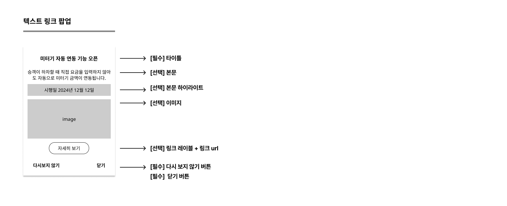

##### 구성 요소 상세

- 필수 구성 요소는 팝업 게시 시 필수 구성 요소로서 미노출 처리가 불가하다.
- 선택 구성 요소는 운영자가 팝업 게시 목적에 맞게 포함 또는 불포함 처리할 수 있다.  
- 같은 구성 요소는 동일한 텍스트 크기, 색상 등 동일한 스타일을 가진다. 
- 연결 가능한 링크는 웹링크, 딥링크, 공지사항 상세 페이지로 랜딩 가능하다. 
- 팝업 디자인 가이드라인의 최대 height를 초과하는 경우 버튼 영역을 제외한 영역에 대해서 스크롤 가능하다.

| 구성 요소          | 필수/선택 | 커스텀 가능 여부 | 입력 제약 조건                                 |
| ------------------ | --------- | ---------------- | ---------------------------------------------- |
| 타이틀             | 필수      | 가능             | 한영 40자까지 입력 가능                        |
| 본문               | 선택      | 가능             | 한영 500자까지 입력 가능                       |
| 본문 하이라이트    | 선택      | 가능             | 한영 100자까지 입력 가능                       |
| 이미지             | 선택      | 가능             | - width 고정  - height 이미지 비율대로 조정 |
| 링크 레이블        | 선택      | 가능             | 한영 18자                                      |
| 링크 타입          | 선택      | 가능             | 웹링크 / 딥링크 / 공지사항 링크 타입 선택 가능 |
| 링크 url           | 선택      | 가능             | 확인 필요                                      |
| 다시보지 않기 버튼 | 필수      | 불가             | -                                              |
| 닫기 버튼          | 필수      | 불가             | -                                              |

##### 팝업 동작 

| 선택 영역        | 동작 상세                                                    |
| ---------------- | ------------------------------------------------------------ |
| 링크 레이블 영역 | - 웹링크 선택 시 팝업 닫힘 + 인앱 브라우저로 해당 url 랜딩  - 딥링크 선택 시 팝업 닫힘 + 해당 앱 화면으로 랜딩  - 공지사항 선택 시 팝업 닫힘 + 해당 공지사항 열린채로 랜딩 |
| 다시보지 않기    | - 재노출 없음                                                |
| 닫기             | - 게시 기간 내 계속 재노출                                   |

##### 활용 예시

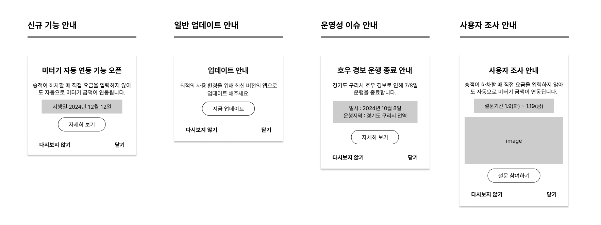

#### b. 강제 업데이트 팝업

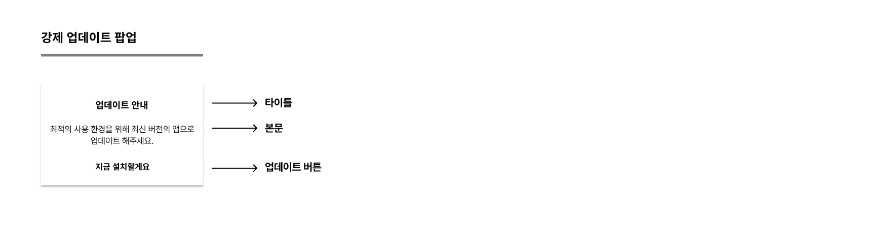

##### 구성 요소 상세

| 구성 요소     | 필수/선택 | 커스텀 가능 여부 | 입력 제약 조건           | 비고                                   |
| ------------- | --------- | ---------------- | ------------------------ | -------------------------------------- |
| 타이틀        | 필수      | 가능             | 한영 40자까지 입력 가능  | 운영툴에서 프리셋 문구 제공, 수정 가능 |
| 본문          | 필수      | 가능             | 한영 500자까지 입력 가능 | 운영툴에서 프리셋 문구 제공, 수정 가능 |
| 업데이트 버튼 | 필수      | 불가             | -                        | -                                      |

##### 팝업 동작 

| 선택 영역 | 동작 상세                                                    |
| --------- | ------------------------------------------------------------ |
| 업데이트  | - 팝업 닫힘 + 타겟 앱의 마켓 페이지로 이동하고 업데이트 동선 제공 |

#### c. 강제 시스템 팝업 

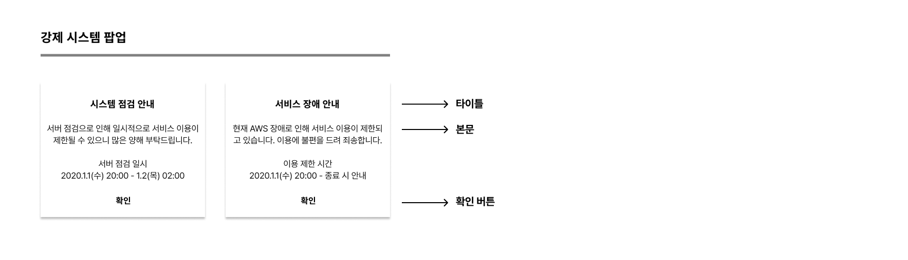

##### 구성 요소 상세

| 구성 요소 | 필수/선택 | 커스텀 가능 여부 | 입력 제약 조건           | 비고                                   |
| --------- | --------- | ---------------- | ------------------------ | -------------------------------------- |
| 타이틀    | 필수      | 가능             | 한영 40자까지 입력 가능  | 운영툴에서 프리셋 문구 제공, 수정 가능 |
| 본문      | 필수      | 가능             | 한영 500자까지 입력 가능 | 운영툴에서 프리셋 문구 제공, 수정 가능 |
| 확인 버튼 | 필수      | 불가             | -                        | -                                      |

##### 팝업 동작 

| 선택 영역 | 동작 상세             |
| --------- | --------------------- |
| 확인      | - 팝업 닫힘 + 앱 종료 |
| Back key  | - 팝업 닫힘 + 앱 종료 |

### C. 노출 정책

#### a. 체크 시점
- 운행 준비 화면 랜딩 시점, 공지 팝업 게시 여부 체크 
- 기노출된 공지 팝업 건이라도 공지 기간 내 재노출 가능
  - 다시 보지 않기 선택 시 팝업 닫힘 + 공지 기간 남아 있어도 더 이상 재노출 안함
  - 닫기 선택 시 팝업 닫힘 + 기간 내 재노출

#### b. 노출 대상 

##### 운행 지역
- 사용자의 운행 지역에 해당하는 공지 팝업에 대해서만 노출
  - 구리시에 공지 팝업이 게시되었을 때, 해당 팝업을 구리시 기사님은 확인 가능하나 남양주 시 기사님은 확인 불가
  - 단, 전체 지역에 게시된 공지 팝업은 모든 기사님이 확인 가능
  - 단, 강제 업데이트 팝업과 강제 시스템 팝업은 운행 지역 구분 없이 공통으로 노출

##### 앱 버전 
- 팝업 게시 시점에 설정한 특정 앱 버전 사용자에게만 노출 가능  
- 예) X.X.X 이상 X.X.X 이하

##### 게시 기간
- 팝업 게시 시점에 설정한 게시 기간 내에만 노출 가능
- 예) YYYY.MM.DD. HH:MM ~ YYYY.MM.DD. HH:MM

## (5) 공통 중요 공지 팝업 (한시적 운영)

### A. 체크 시점

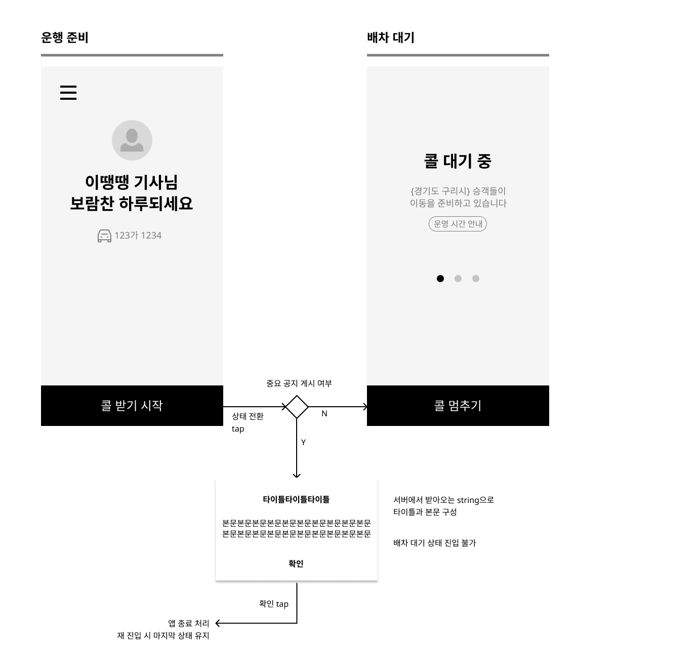

### B. 사용 예시

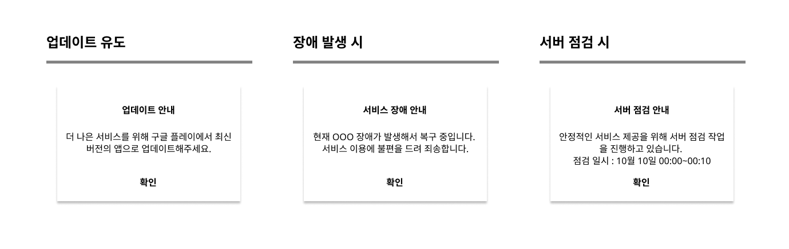

## (5) 공통 Flow (🍡v4.11)(❄️v4.10)

### A. 전화 연결

#### a. 문의 전화 연결 (❄️v4.10)

##### 심사처 전화 연결

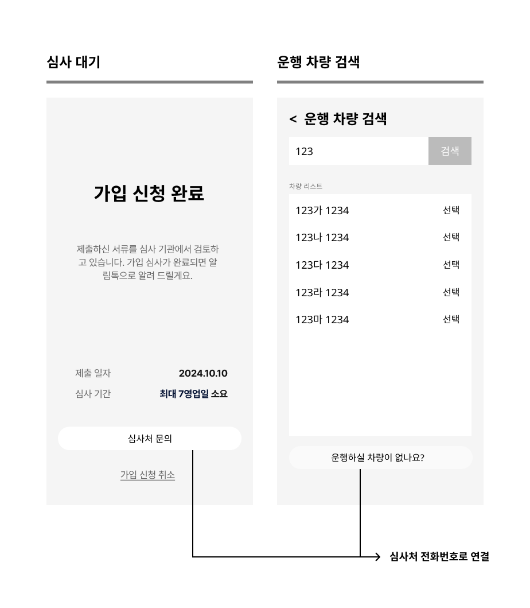

- [심사 대기], [운행 차량 검색] 화면 내 `심사처 문의` 버튼 노출

  - 선택 시, 심사처 전화번호로 연결

  

##### 기사고객센터 전화 연결

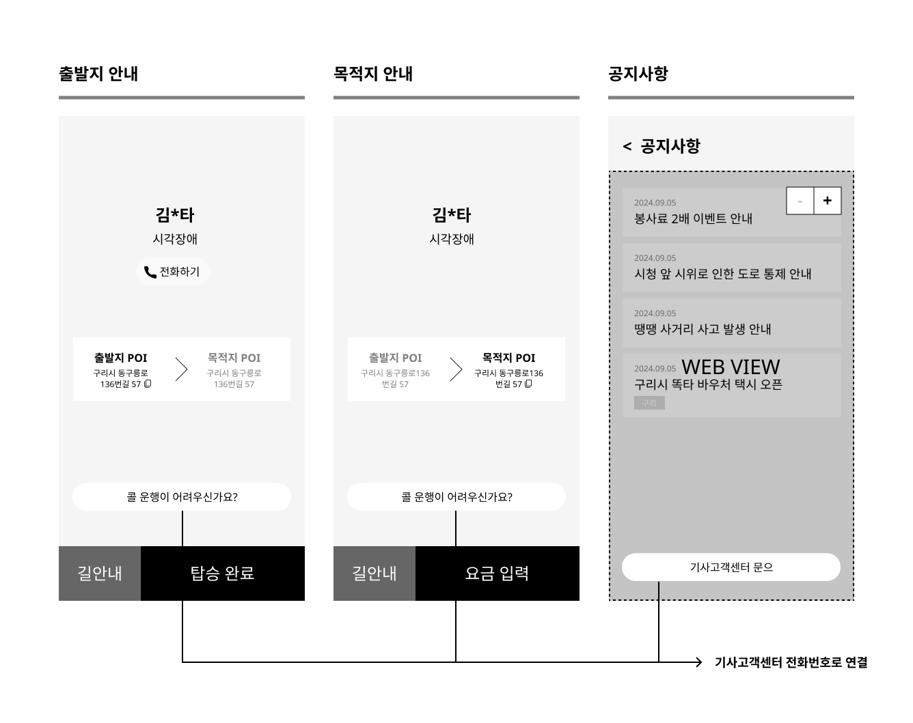

- [출발지 안내], [목적지 안내], [공지사항] 화면 내 `기사고객센터 문의` 버튼 노출
  - 선택 시, 기사고객센터 전화번호로 연결

##### 상세 플로우

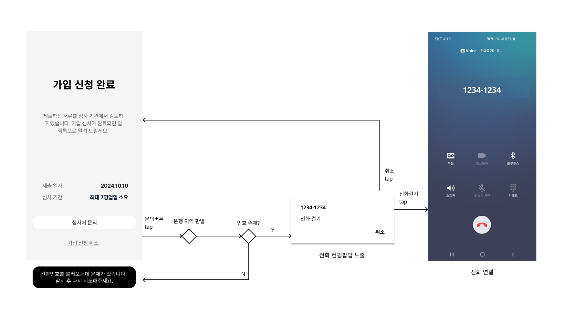

- 전화 버튼 선택마다, 해당 택시 서비스 타입/진입점에 맞게 하드코딩된 전화번호 값 판별 

  > (History) v4.10 신규 택시 서비스 타입(영암, 영덕) 하드코딩 대응 / 향후 택시 서비스 타입 정식 스펙화 시점에 추가 대응 예정

- 불러온 전화 번호에 대해서 전화 걸기 컨펌 팝업 노출

- 전화 걸기 팝업에서 전화 걸기 선택 시 통화 진행

- 만일, 해당 전화 번호 값이 없다면, 에러 토스트 노출 

#### a. 승객 전화 연결 (🍡v4.11)

##### 상세 플로우 

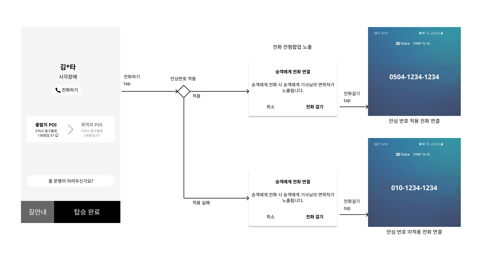

- 호출자 전화번호로 연결한다.
  - 단 라이더 앱 내 `호출 받을 전화번호`를 선택하는 경우, 선택한 번호로 연결한다.(🍡)

- 안심 번호 적용 여부와 상관 없이 동일한 컨펌 팝업 노출 
- 단, 안심 번호 적용 성공 시에만 안심 번호를 노출하고, 실패 시에는 승객 번호가 그대로 노출된다. 

### B. 사진 올리기 동작 공통

#### a. 사진 종류
- 프로필 사진
- 택시운전자격증명
- 차량 후면 번호판 사진
- 사업자등록증 사진

#### [추후] b. 카메라 촬영 가이드
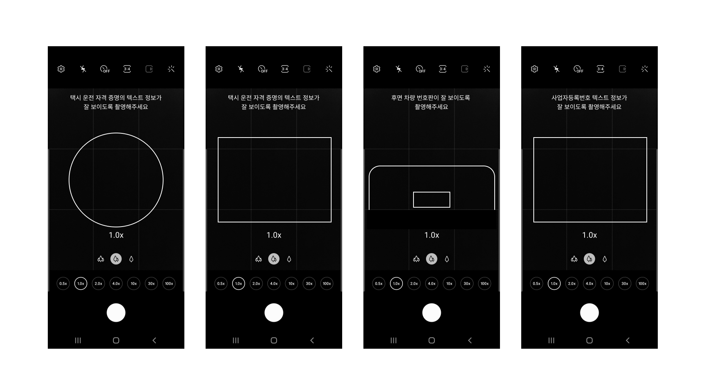

#### [추후] c. 공통 동작
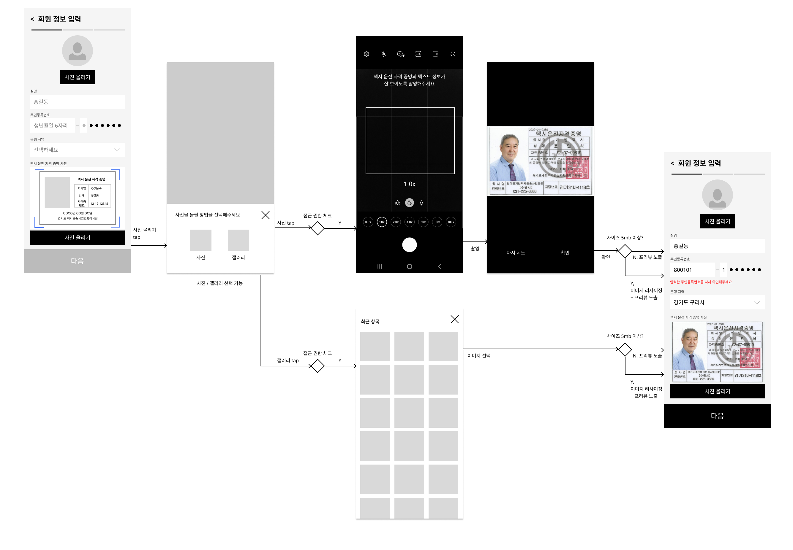
- 서버에 이미지 송신 시 이미지 확대/축소/크롭 등 수정 불가
- 단, 프리뷰 화면에서는 각 문서의 가이드 영역에 맞게 크롭해서 노출

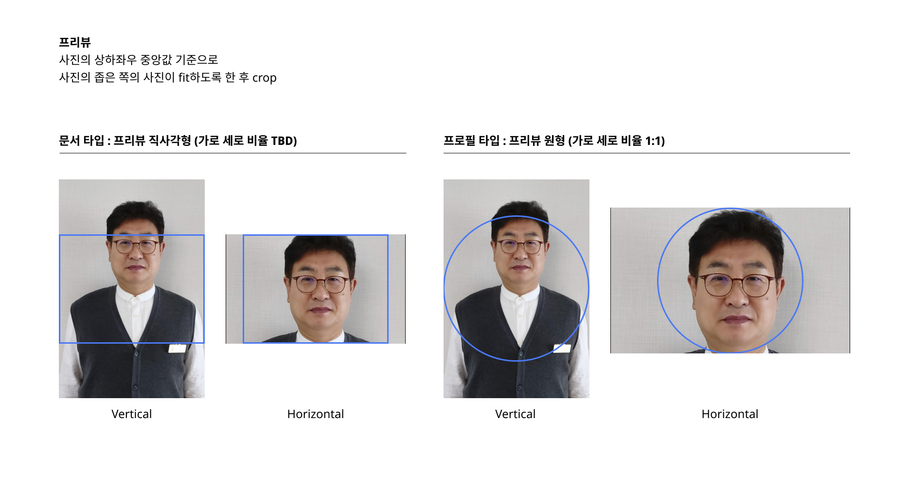

#### d. 프로필 사진 안내 팝업
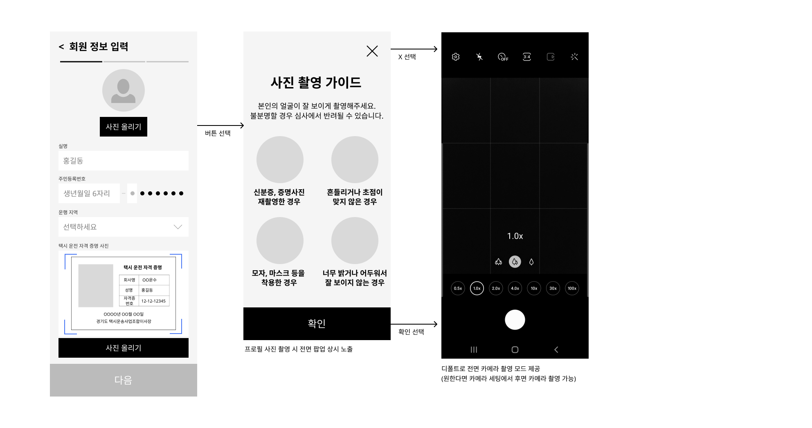

- 개인 / 법인 공통 회원 공통 사진 촬영 가이드 팝업 노출 
- 디폴트로 전면 카메라 촬영 모드 제공 

### C. 앱 종료 후 재실행 시 랜딩 처리

#### a.  케이스 정의

- 비정상으로 앱이 종료되거나 실수로 앱을 종료시키고 재진입하는 상황 
- getSupply = Ready or On-route or Occupied  && Driver ID 일치 

#### b.  플로우 상세

- 운행 준비 화면 또는 메뉴 하위 화면에서 앱 종료 시, 일괄 운행 준비 화면으로 랜딩한다. 
- 배차 대기, 콜 안내, 호출 취소 화면에서 앱 종료 시, 일괄 배차 대기 화면으로 랜딩한다.
  - Ready 상태에서 이탈 시, Ready 상태로 랜딩 
- 출발지 안내 화면에서 앱 종료 시, 출발지 안내 화면으로 랜딩한다. 
  - On-route 상태에서 이탈 시, On-route 상태로 랜딩 
  - 네비게이션 실행 여부에 상관 없이 항상 출발지 안내 화면으로 랜딩
- 목적지 안내 화면, 요금 입력 화면, 결제 중 화면에서 앱 종료 시, 목적지 안내 화면으로 랜딩한다. 
  - Occupied 상태에서 이탈 시, Occupied 상태로 랜딩
  - 네비게이션 실행 여부에 상관 없이 항상 목적지 안내 화면으로 랜딩
- 요금 결제 완료 후 앱 종료 시, 배차 대기 화면으로 랜딩한다. 
  - Ready 상태에서 이탈 시, Ready 상태로 랜딩 
  
- 앱 종료 후 로그인 세션이 만료되었을 때는 앱 재실행 시 일괄적으로 로그인(휴대폰OTP) 화면으로 랜딩한다. 

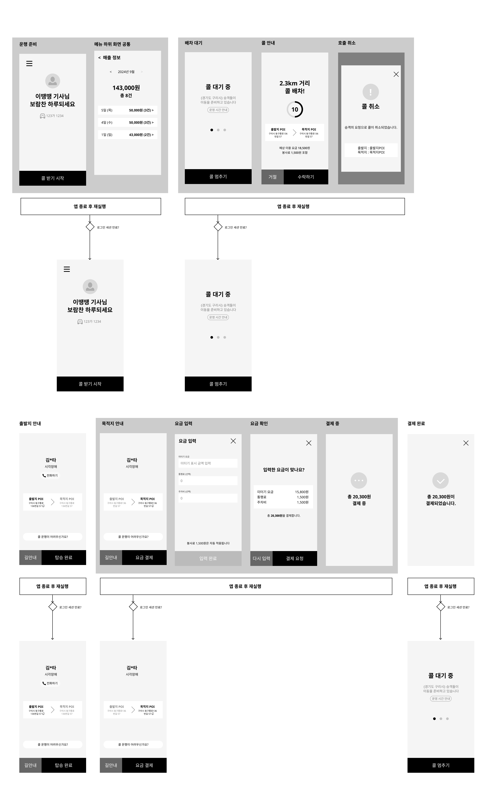

### D. 1 차량 2 기사 케이스 대응

#### a.  케이스 정의

- 드라이버 1, 2가 A 차량을 주야간으로 점유 중인 상황
- 드라이버 1이 A 차량으로 운행(READY, ON_ROUTE, OCCUPIED)하고 있는데 드라이버 2가 로그인하는 경우, 드라이버 2의 진입을 막는다

#### b.  플로우 상세

- 운행 준비 화면에서 콜 받기 시작 버튼 선택 시 배차 대기(READY) 상태 전환 불가
  - getSupply = Ready or On-route or Occupied  && Driver ID 불일치  

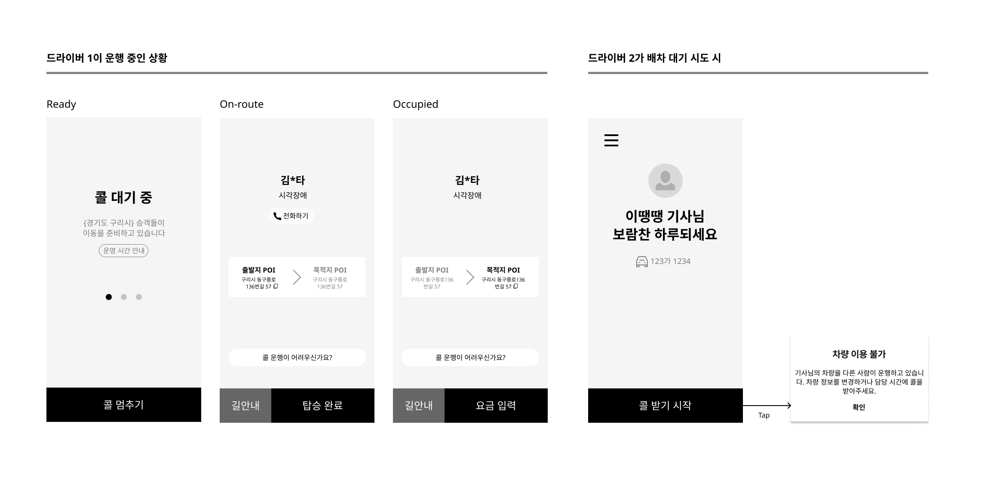

- 단, 드라이버1이 운행 준비(Off) 상태일 때는 드라이버 2가 배차 대기 상태로 전환 가능
  - getSupply = OFF && Driver ID 빈 값 or Driver ID 일치

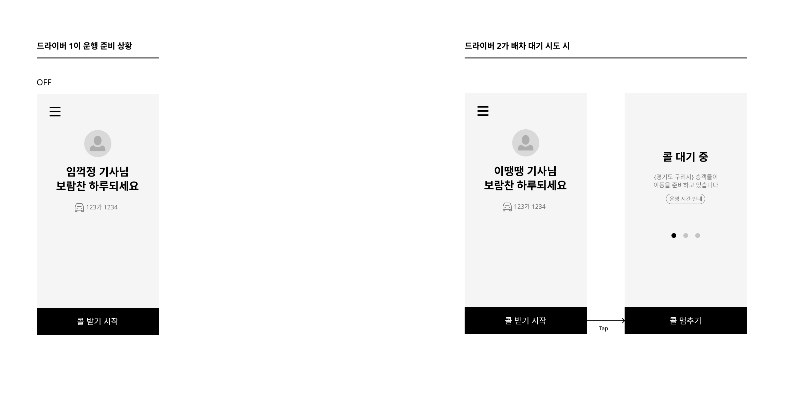

### D. 웹뷰 내 글자 크기 조정

#### a. 웹뷰 모음

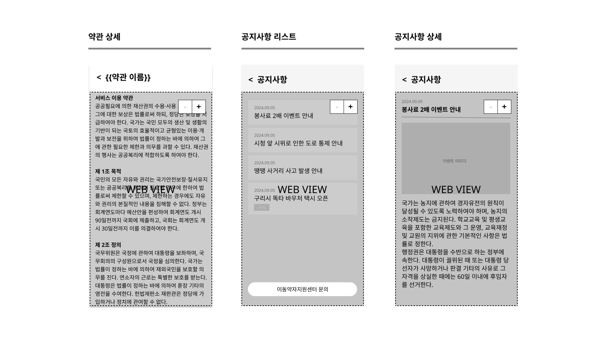

#### b. 글자 크기 조정 동작 공통

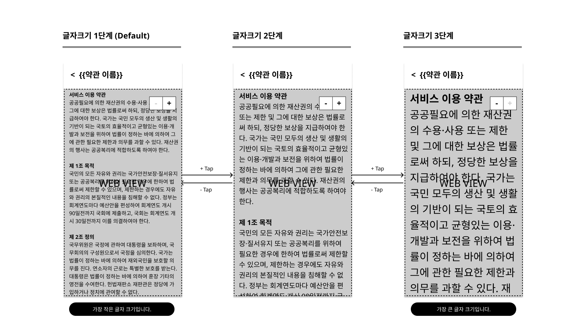

- 글자 크기는 총 3단계이며 최초 진입 시 1단계 크기로 노출한다.
- 더 크게 정보를 확인하고 싶을 때, + 버튼을 통해 확대 가능하다.
- 더 작게 정보를 확인하고 싶을 때, - 버튼을 통해 축소 가능하다.
- 더 이상 확대, 축소가 불가능할 경우, 불가한 동작 버튼은 딤드 처리되고 토스트가 노출된다. 
- 글자 크기는 서비스에서 제공하는 모든 웹뷰에서 조정할 수 있다.
- 마지막으로 사용자가 설정한 글자 크기 값을 유지한다.
  - 예를 들어, 공지사항에서 3단계 글자 크기로 적용 시, 약관에서도 3단계 글자 크기로 적용

### E. 주소 복사

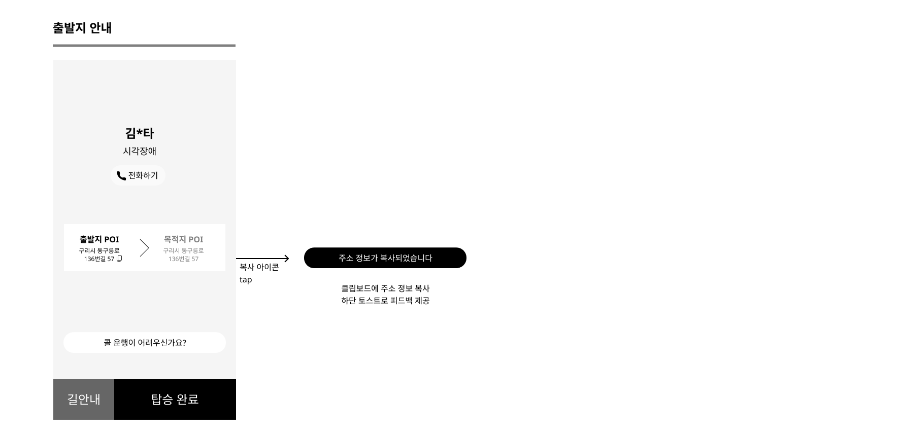

- 출발지의 도로명 주소 정보를 클립 보드에 복사할 수 있다. 
- 클립 보드에 복사 완료 시, 하단 토스트를 통해 피드백을 제공한다. 

### F. 첨부 이미지 리사이징

- 첨부 이미지 공통으로 다음과 같이 리사이징 처리합니다. 

#### a. 리사이징 대상
- 사진 파일 크기가 5mb 초과 시 

#### b. 리사이징 처리
- 사진 파일 크기가 5mb 이하가 될 때까지 일정 비율로 리사이징 진행 처리

### G. 스트림 단절 
#### a. 기준 시간 내 재연결 시도 
- 기준 시간 2분 내 지속적으로 재연결 시도 

#### b. 재연결 실패 시 동작 정의 
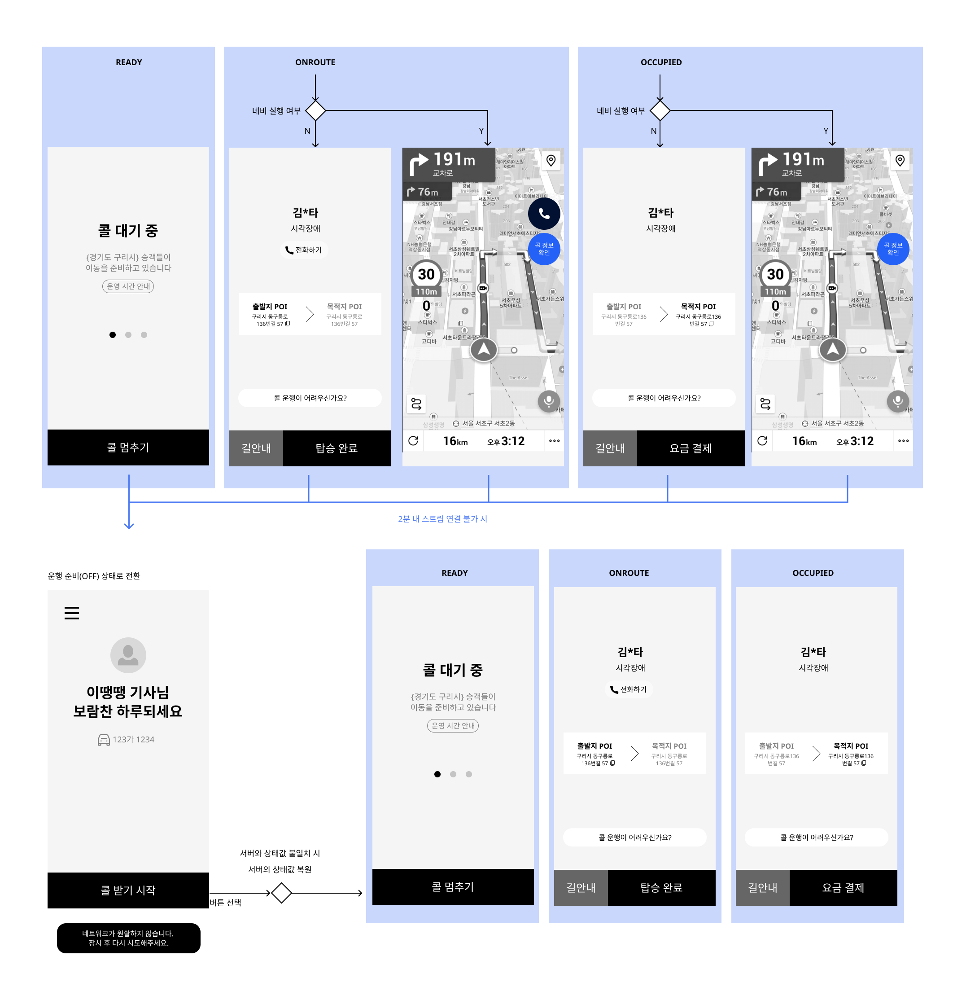

- 기준 시간 내 재연결 실패 시 운행 준비(OFF) 상태로 화면 전환
  - 포그라운드에서 화면 전환 시 네트워크 불안정 에러 스낵바 추가 제공 
  - 앱이 백그라운드에서 실행 중일 때 화면 전환 시에서는 에러 스낵바 제공 생략
- [콜 받기 시작] 버튼 선택 시점에 서버가 알고 있는 SupplyState이 OFF가 아니라면, 해당 상태값으로 복원 

## (6) 알림음

- 활용 가능한 알림음 있을지 확인 필요 : 드라이버에 적용됬었던 "셔클!" 음원
- 콜 안내 카드 노출 시점에만 알림음 적용
- 추후 주요 전환이 일어나는 화면에서 TTS 기능 적용을 검토

## (7) 시각 정보 최적화

- 오픈 스펙으로는 앱 내 모든 화면의 메시지는 시스템 폰트를 따라가지 않는다.
- 오픈 스펙으로는 화면 밝기 조정 및 다크 모드 등을 고려하지 않는다. 
- 추후 장시간 운전을 하는 사용자의 편의성을 고려하여 관련 기능을 고도화한다. 

## (8) 날짜 표기 

- 년월일 : yyyy년 m월 d일 (예 : 2024년 9월 1일)
- 월일 : m월 d일 (예 : 9월 1일)
- 시분 : hh:mm (예 : 17:01)
  - 오전/오후 구분 없음 24시간제로 노출
- 시분초 : hh:mm:ss (예 : 17:01:01)
  - 오전/오후 구분 없음 24시간제로 노출

## (9) 안드로이드 Back 키 동작

### A. 공통

| 화면 조건                       | 사용자 액션        | 기대 동작                                     |
| ------------------------------- | ------------------ | --------------------------------------------- |
| 팝업/바텀시트 노출 중 모든 화면 | `Back`             | 팝업/바텀시트 닫힘                            |
| 화면 좌상단 백키 기정의된 화면  | `Back`             | 이전 화면 이동                                |
| 모든 화면                       | `Back`             | 화면 전환 없음                                |
| 모든 화면                       | 연속 `Back`+`Back` | 앱 백그라운드 전환 (`Home`키와 동일하게 동작) |

- 별도 화면 별 Back 키 동작의 정의되지 않은 경우, 공통 원칙을 따른다. 

