# DRT ETA 관련 타 서비스 화면 레퍼런스

> 분석 항목: ① 페널티/수수료 면제 기준 ② ETA 변동 가능성 및 범위 안내 ③ ETA 변동 알림
> 수집 서비스: MOIA (독일), ioki (독일 · ArrivaClick 기반 플랫폼), RideCo (북미)

---

## 1. MOIA — Hamburg, Germany

> VW Group 운영, 함부르크 최대 전기차 기반 DRT 서비스 (2019~)
> 앱 기반 가상 정류장 방식, 합승 최적화 알고리즘
> 헬프센터에 ETA · 지연 · 취소 UX를 상세히 공개 중

---

### ② ETA 안내 — 픽업 3단계 상태 변화

**배차 직후**: 픽업까지 남은 시간 + 정류장명

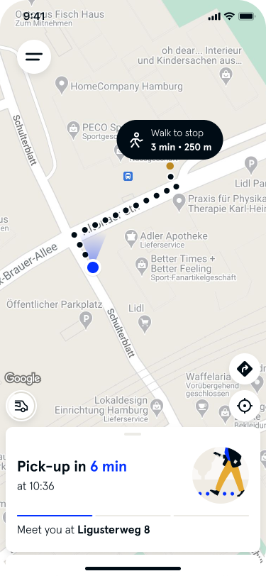

> `"Pick-up in 6 min at 10:36"`
> `"Meet us at Ligusterweg 8"`
> 단일 시각이 아닌 **"n분 후"** 카운트다운 방식

---

**배차 3분 전**: 차량 번호 노출 + 실시간 추적

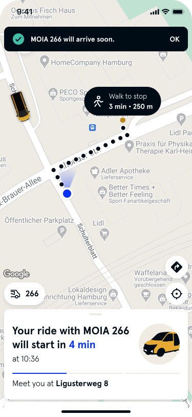

> `"MOIA 266 will arrive soon."` (상단 토스트 알림)
> `"Your ride with MOIA 266 will start in 4 min"`

---

**도착 직전**: 상태 메시지 전환

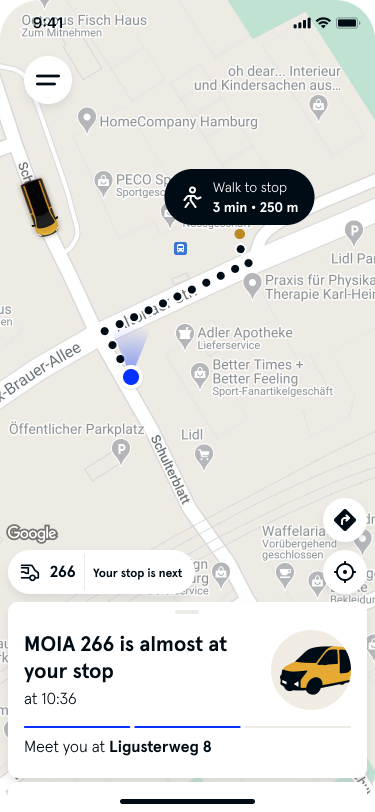

> `"MOIA 266 is almost at your stop"`
> `"266 · Your stop is next"` (차량 정보 바)

---

### ③ ETA 변동 알림 — 지연 발생

**지연 예고 — 픽업 전**

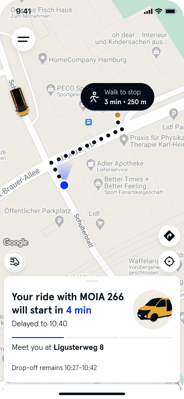

> `"Your ride with MOIA 266 will start in 4 min"`
> `"Delayed to 10:40"` **(빨간 텍스트)**
> `"Drop-off remains 10:27–10:42"` → 드롭오프 범위는 유지

---

**지연 — 탑승 중 드롭오프 화면**

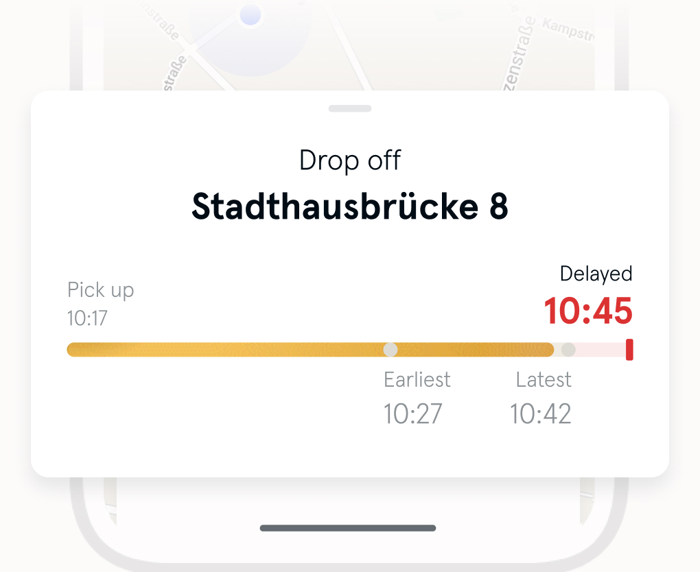

> `"Drop off: Stadthausbrücke 8"`
> `"Pick up: 10:17"`
> `"Delayed 10:45"` **(빨간 굵은 숫자)**
> 골든 → **빨간 마커**로 프로그레스 바 전환
> `"Earliest 10:27 / Latest 10:42"` 범위 하단 유지

---

**지연 — 픽업 전 (독일어 원본 화면)**

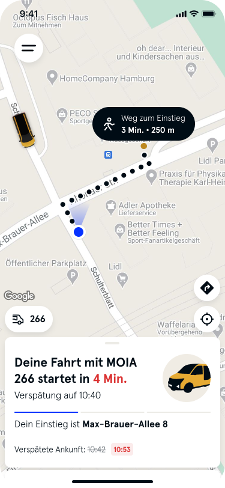

> `"Deine Fahrt mit MOIA 266 startet in 4 Min."`
> `"Verspätete Ankunft: 10:42 → 10:55"` **(기존 → 새 시각 함께 표시)**

---

### ① 페널티 면제 — 취소 화면

**취소 전: 예약 상세 + Cancel trip 버튼**

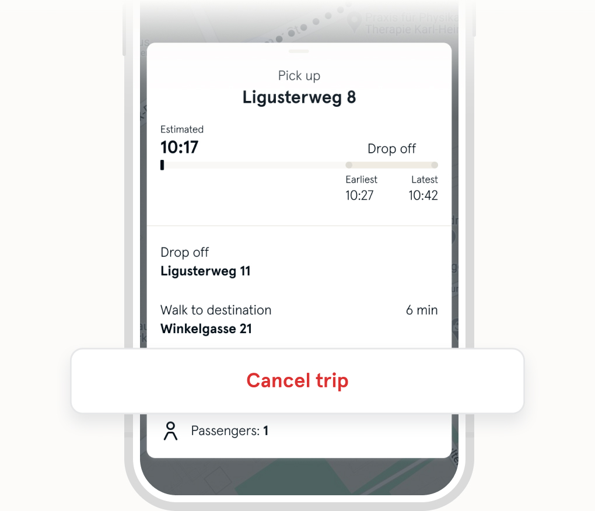

> `"Pick up: Ligusterweg 8"` / `"Estimated 10:17"`
> `"Drop off — Earliest 10:27 / Latest 10:42"`
> 하단 `"Cancel trip"` 빨간 버튼

**MOIA 취소 수수료 면제 조건 (앱 내 명시)**
- 픽업 **10분 이상 지연** 시 수수료 자동 면제
- 앱이 지연 감지 → 취소 시 자동으로 면제 처리 표시
- 취소 10분 전까지는 무료, 10분 이내는 최대 5€

---

**취소 후: 이유 선택 서베이**

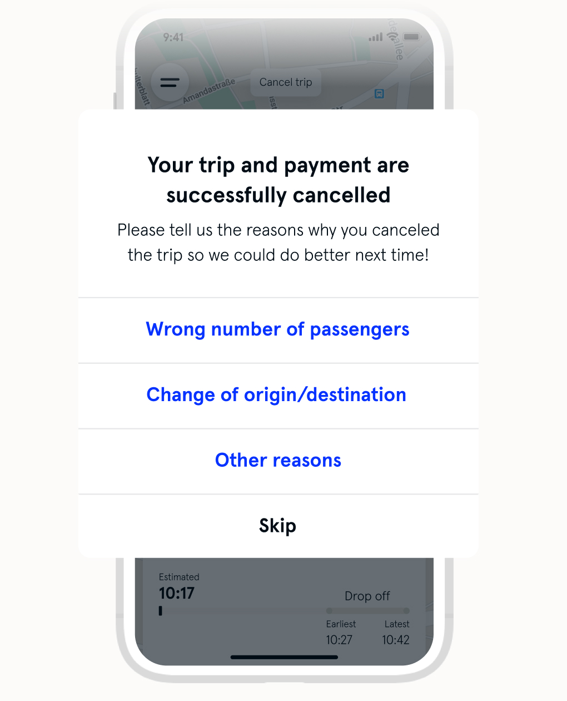

> `"Your trip and payment are successfully cancelled"`
> `"Please tell us the reasons why you canceled the trip so we could do better next time!"`
>
> - Wrong number of passengers
> - Change of origin/destination
> - Other reasons
> - Skip

---
---

## 2. ioki — Germany (ArrivaClick 기반 플랫폼)

> 독일 Deutsche Bahn 계열 DRT 플랫폼
> 유럽 전역 DRT 서비스에 사용 (영국 ArrivaClick, 독일 다수 지자체 등)
> 앱 + 웹 예약 지원

---

### ② ETA 안내 — 예약 화면

**승객 추가 + 예약 옵션**

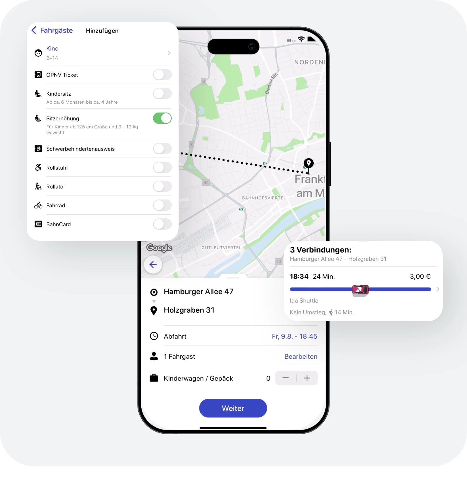

> 승객 유형 선택: Erwachsener(성인) / Kind(어린이) / Kleinkind(유아)
> 옵션: ÖPNV Ticket / Kindersitz / Sitzerhöhung / Rollstuhl / Fahrrad / BahnCard
> 우측 앱: 출발지 `"Hamburger Allee 47"` → 도착지 `"Holzgraben 31"`
> **"3 Verbindungen"** (3개 연결편) 제시
> 첫 번째 옵션: `"18:34 24 Min. 3,00€ | Ida Shuttle | Kein Umstieg | 14 Min."`

**웹 예약 — 승객 추가 화면 (독일어)**

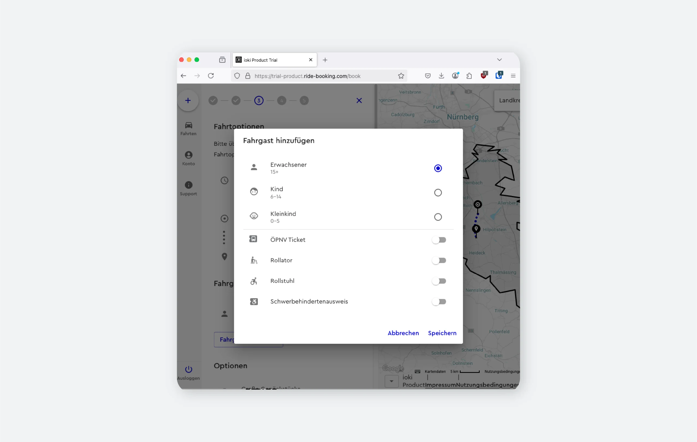

> 승객 구분: Erwachsener(15+) / Kind(6~14) / Kleinkind(0~5)
> 접근성 옵션: ÖPNV Ticket / Rollator / Rollstuhl / Schwerbehindertenausweis
> 지도와 사이드패널 병렬 레이아웃

**특징:**
- 단순 시각 입력이 아니라 `"Abfahrt"` (출발) 시간 + 환승 없음 옵션 제시
- 연결편을 **복수 옵션으로 제시** → 유저가 선택

---
---

## 3. RideCo — North America

> 북미 최대 DRT 플랫폼 중 하나
> San Antonio VIA, Houston METRO, SEPTA 등 주요 대중교통 기관 사용
> "Guaranteed Arrives Before Time" 방식으로 ETA 불안 해소

---

### ② ETA 안내 — 예약 화면

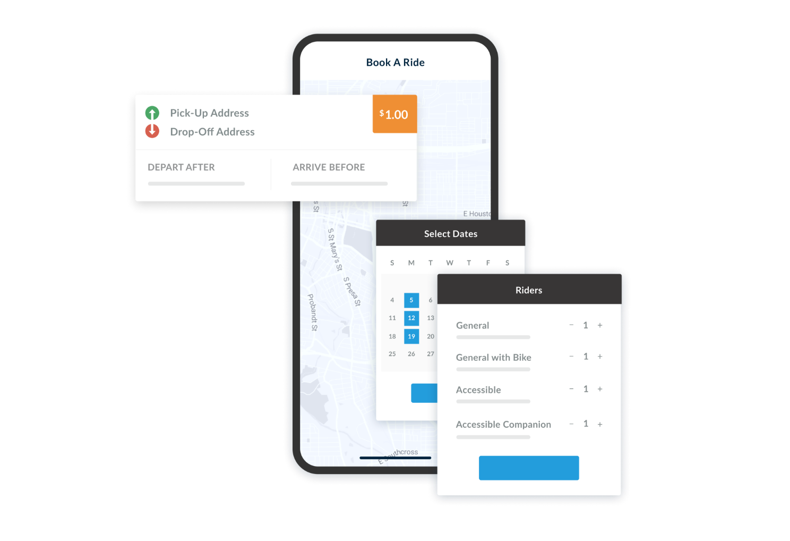

> **"DEPART AFTER"** / **"ARRIVE BEFORE"** 이중 옵션
> 승객 유형: General / General with Bike / Accessible / Accessible Companion
> 달력 날짜 선택 → 승객 수 설정

**특징:**
- 단순 출발 시간 입력이 아니라 **"언제까지 도착해야 하는가"** 로 예약
- 유저가 도착 마감 시간을 설정 → 시스템이 ETA 변동 허용 폭을 그 범위 내에서 관리
- ETA 변동의 리스크를 **시스템이 흡수**하는 구조

---
---

## 종합 비교

| 항목 | MOIA | ioki | RideCo |
|---|---|---|---|
| **ETA 표시** | "n분 후" 카운트다운 | 복수 연결편 옵션 제시 | DEPART AFTER / ARRIVE BEFORE |
| **하차 시간** | Earliest / Latest 범위 표시 | 소요시간으로 안내 | 도착 보장 시간 |
| **지연 안내** | 빨간 텍스트 + 기존→신규 시각 표시 | 앱 내 자동 업데이트 | 실시간 업데이트 |
| **면제 조건 명시** | ✅ 10분 지연 시 자동 면제, 앱에 표시 | 별도 명시 없음 | 별도 명시 없음 |
| **취소 이유 수집** | ✅ 4가지 선택지 서베이 | — | — |
| **서비스 특성 안내** | 헬프센터에 상세 설명 | 연결편 옵션으로 자연스럽게 전달 | 예약 방식으로 기대치 설정 |

---

## 핵심 패턴 요약

### 1. 단일 시각 → 범위 또는 카운트다운으로
MOIA: `"n분 후"` / RideCo: `"Earliest~Latest"` / ioki: `"출발 시간대 옵션"`

### 2. 지연 시 기존 시각과 새 시각 동시 표시 (MOIA)
> `"10:42 → 10:55"` 형태로 변동 전/후를 함께 보여줌

### 3. 면제 조건을 앱에서 자동 처리 (MOIA)
취소 시점에 지연 여부를 앱이 감지해서 수수료 면제 자동 적용

### 4. 취소 후 이유 수집 (MOIA)
서비스 개선을 위한 VOC 데이터를 취소 플로우 안에 자연스럽게 통합

---

*출처: [MOIA Help Center](https://help.moia.io) · [ioki Platform](https://ioki.com/en/platform/features/) · [RideCo Passenger App](https://www.rideco.com/products/passenger-app) · [VIA Link](https://www.viainfo.net/link/)*
